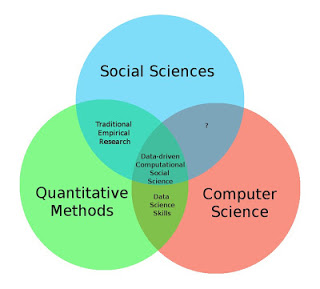

```{r child = here::here("_common-slides.Rmd"), cache = FALSE}

```

```{r packages, include=FALSE}
library(tidyverse)
library(patchwork)
library(here) 
```

# Learning objectives

* Define computational social science
* Connect mathematics and statistics to social scientific inquiry
* Review course logistics
* Explain the pedagogical approach for the camp
* Define basic mathematical notation
* Assess the use of mathematical notation in the rational voter theory
* Define functions and their properties
* Define sets
* Practice root finding

---

# Computational social science

* Social science - the scientific study of human society and social relationships

### Disciplines within social science

* Anthropology
* Economics
* History
* Political science
* Psychology
* Sociology

### Interdisciplinary programs

* Comparative human development
* Conceptual and historical studies of science
* Computational social science

---

# Computational social science

* Computational approaches to the social sciences
* Historic definition
* Modern definition

---

# Computational social science

```{r css-img, out.width="75%", fig.cap="Venn diagram of disciplines"}

```

---

# Acquiring CSS skills

* **Computer science**
    * CAPP 30121/122/123 sequence
    * MACS 30500
--
* **Social science**
    * Perspectives sequence (MACS 30000/100/200)
    * Seminars
    * Non-computational courses
--
* **Math/statistics**
    * Mathematical models of social worlds
    * Probability and statistics used across sciences
    * Start with Computational Math Camp
    * Math/stats electives
--
        * Machine learning
        * Causal inference
        * Bayesian inference
        * Network analysis
        * Deep learning
        * Spatial data science
        * Natural language processing

---

# Math, probability, and statistics

### Mathematics
* Purely abstract
* Based on axioms that are independent from the real world
* Language for expressing structure and relationships

--

### Probability
* Systematic and rigorous method for treating uncertainty
* "Mathematical models of uncertain reality"
* Derivation of "applied mathematics"

--

### Statistics
* Collecting and analyzing numerical data in large quantities
* Purpose of inferring proportions in a whole from those in a sample
* Making inferences from data that are not entirely certain

---

# Their uses

* **Mathematical models**
    * Game theory
    * Formal theory
    * Much bigger in economics
    * Defining statistical models and relationships
* **Probability/statistics**
    * Establishing a structure for relationships between variables using data
    * Inferring relationships and assessing their validity

---

# Goals for the math/stats camp

* Computational Math Camp $\leadsto$ Computational Mathematics and Statistics Camp

--
* Survey math and statistical tools that are foundational to CSS
* Review common mathematical notation
* Apply math/statistics methods


**NOTE: we will move FAST -- do your best to keep up and follow along. Come to OH and please check in when/as needed!**

---

# Course logistics

* [Course site](https://github.com/math-camp/course)
* [Canvas course](https://canvas.uchicago.edu/enroll/MWWG9D)
* Gradescope (accessed via Canvas)

--

## Course staff

* Dr. Jean Clipperton: clipperton@uchicago.edu 
* Bailey Meche baileymeche@uchicago.edu
* Gabe Reichman gabereichman@uchicago.edu
* Shirley Zhang xueyan1220@uchicago.edu
* Stanley Yi yijiaying@uchicago.edu


---

# Prerequisites

* No formal prerequisites
* Prior training in:
    * Linear algebra
    * Calculus
    * Probability theory
    * Statistical inference
* High school/AP/IB training may be sufficient
* We assume prior exposure to the content covered in this camp
* Alternatives to this camp: through PS department (conflicts with computing boot camp)

---

# Evaluation

* Pass/fail (no credit)
* Show up, complete the problem sets satisfactorily (not perfectly), and you'll pass
* The irony of grad school
    * Grades no longer matter (or should not)
    * Learn as much material as possible
    * **If you truly only care about learning material, you'll do well**

---

# Pedagogical approach

* Focus on participation and engagement
* Practice questions integrated
* Regular assignments to check understanding

## Paths to success

* Work together
* Ask for help
* Get quick feedback

---
    
# Why are we doing this?

* This is the magic that makes our models work
* Implicit knowledge: no explicit focus on proofs but understanding assumed

---

# Why math is important to social science

* Consistent language to communicate ideas in an orderly and systematic way
* Science uses highly precise language that is not easily interpretable to outsiders
* Mathematics is an effective way to describe our world
* Mathematical notation lets us convey **precision** and minimizes the risk of misinterpretation by other scholars

---

# Example: Rational voter theory

* Rational voters should weigh the rewards vs. costs of voting
    * If it costs more to vote than the rewards gained from the action, then individuals should not vote in elections
    * Difference between cost and reward is defined as the **utility** that the person receives from the act (based on an unknown preference scale)
* How can we codify this model using mathematical notation?

---

# Example: Rational voter theory

$$R = PB - C$$

* $R =$ the utility satisfaction of voting
* $P =$ the actual probability that the voter will affect the outcome with her particular vote
* $B =$ the perceived difference in benefits between the two candidates measured in **utiles** (units of utility)
* $C =$ the actual cost of voting in utiles (e.g. time, effort, money)

--
* What implications does the model provide?
* How would you express them mathematically?

---

# Example: Rational voter theory

Implication | Formal statement
------------|------------------
If individuals do not get enough benefit from voting, they will abstain | The voter will abstain if $R < 0$.
Individuals have other things to do on election day (like going to work). If the benefit of voting is not as large as alternative benefits, then individuals will abstain. | The voter may still not vote even if $R > 0$ if there exist other competing activities that produce a higher $R$.
Most elections have thousands, if not millions, of ballots cast. There is no point to voting since any individual ballot is unlikely to change the outcome of the election. Therefore everyone should abstain. | If $P$ is very small, then it is unlikely that this individual will vote.

--

* Paradox of voting
* Simple model, but incredibly impactful
* Pure mathematical model may not be fully accurate, but allows us to delve deeper into the paradox
    * How to measure $B$
    * How to measure $C$

---
class: center, inverse, middle


# **Questions?**

---

# Sets

* Collection of objects

$$
\begin{aligned}
A & = \{1, 2, 3\} \nonumber  \\
B  & = \{4, 5, 6\}\nonumber  \\
C  & = \{ \text{First year cohort} \} \\
D & = \{ \text{U of Chicago Lecturers} \}
\end{aligned}
$$

---

# Sets

* If $A$ is a set, we say that $x$ is an element of $A$ by writing $x \in A$
* If $x$ is not an element of $A$ then, we write $x \notin A$

--

* $1 \in \{ 1, 2, 3\}$
* $4 \in \{4, 5, 6\}$
* $\text{Will} \notin \{ \text{First year cohort} \}$
* $\text{Jean} \in \{ \text{U of Chicago SIPs} \}$

--

Why do we care about sets?

* Sets are necessary for probability theory
* Defining **set** is equivalent to choosing population of interest (usually)

---

# Subsets

* If $A$ and $B$ are sets, then we say that $A = B$ if, for all $x \in A$ then $x \in B$ and for all $y \in B$ then $y \in A$
* Test to determine equality:
    * Take all elements of $A$, see if in $B$
    * Take all elements of $B$, see if in $A$

--

-----------

* If $A$ and $B$ are sets, then we say that $A \subset B$ is, for all $x \in A$, then $x \in B$
    * What is the difference between the definitions?

---

# Set builder notation

Some famous sets:

* $\mathbb{N} = \{1, 2, 3, \ldots \}$
* $\mathbb{Z} = \{\ldots, -2, -1, 0, 1, 2, \ldots, \}$
* $\Re = \mbox{Real numbers}$

--

Use **set builder notation** to identify subsets:

* $[a, b]  = \{x: x \in \Re \text{ and } a \leq x \leq b \}$
* $(a, b]  = \{x: x \in \Re \text{ and } a < x \leq b \}$
* $[a, b)  = \{x: x \in \Re \text{ and } a \leq x <  b \}$
* $(a, b)  = \{x: x \in \Re \text{ and } a < x < b \}$
* $\emptyset$

---

# Union

* $A$ and $B$ are sets
* New set that contains all elements in set $A$ *or* in set $B$

    $$\begin{aligned}C & = A \cup B  \\   & = \{x: x \in A \text{ or } x \in B \}\end{aligned}$$

--

* $A = \{1, 2, 3\}, B = \{3, 4, 5\}$, then $C = A \cup B  = \{ 1, 2, 3, 4, 5\}$
* $D  = \{\text{First Year Cohort} \}, E = \{\text{Me} \}$, then $F = D \cup E = \{ \text{First Year Cohort, Me} \}$

--

This of the union as a list of the elements that are present (not an accounting of their number).

---

# Intersection

* New set that contains all elements in set $A$ *and* set $B$

    $$\begin{aligned}C  & = A \cap B \\  & = \{x: x \in A \text{ and } x \in B \}\end{aligned}$$

--

* $A =\{1, 2, 3\}, B = \{3, 4, 5\}$, then, $C = A \cap B = \{3\}$
* $D = \{\text{First Year Cohort} \}, E = \{\text{Me} \}$, then $F = D \cap E = \emptyset$

---

# Some facts about sets

1. $A \cap B = B \cap A$
1. $A \cup B = B \cup A$
1. $(A \cap B) \cap C = A \cap (B \cap C)$
1. $(A \cup B) \cup C = A \cup (B \cup C)$
1. $A \cap (B \cup C) = (A \cap B) \cup (A \cap C)$
1. $A \cup (B \cap C) = (A \cup B) \cap (A \cup C)$

---

# Ordered pairs

$$(a, b)$$

* Two sets $A$ and $B$
* Cartesian product

    $$A \times B = \{(a, b): a \in A \text{ and } b \in B \}$$

--
  
Example: $A = \{1, 2\}$ and $B = \{3, 4\}$, then,

$$A \times B = \{ (1, 3); (1, 4); (2, 3); (2, 4) \}$$

---

# Relation

* Relation
* Function $F$ - a relation such that,

    $$
    (x, y) \in F ; (x, z) \in F \Rightarrow y = z
    $$

* $F(x)$
    * $x \in \mbox{Domain} \, F$
    * $F(x) \in \mbox{Codomain} \, F$
    * $F:A \rightarrow B$

---

# Relation

```{r x}
function_plot +
  stat_function(fun = function(x) x) +
  labs(
    title = expression(F(x) == x),
    y = expression(F(x))
  )
```

---

# Relation

```{r x-squared}
function_plot +
  stat_function(fun = function(x) x^2) +
  labs(
    title = expression(F(x) == x^2),
    y = expression(F(x))
  )
```

---

# Relation

```{r x-sqrt}
function_plot +
  stat_function(fun = sqrt, n = 501) +
  labs(
    title = expression(F(x) == sqrt(x)),
    y = expression(F(x))
  ) +
  xlim(0, 4)
```

---

# Relation vs. function

* Mathematical function - a mapping which gives a correspondence from one measure onto exactly one other for that value
* Mapping from one defined space to another, such as $F \colon \Re \rightarrow \Re$

    $$F(x) = x^2 - 1$$
    
    * Maps $x$ to $F(x)$ by squaring $x$ and subtracting 1

--

## Not a function

* All functions are relations, but not all relations are functions

---

# Not a function

```{r y2}
tibble(
  x = rev(seq(0, 10, by = .01)),
  y = sqrt(5 * x)
) %>%
  bind_rows(tibble(
    x = seq(0, 10, by = .01),
    y = sqrt(5 * x) * -1
  )) %>%
  ggplot(aes(x, y)) +
  geom_path() +
  geom_vline(xintercept = 4, linetype = 2) +
  labs(
    title = "Not a function",
    subtitle = expression(y^{
      2
    } == 5 * x)
  )
```

---

# Not a function

```{r less-than}
tibble(
  x = seq(from = -5, to = 5),
  y = 2 * x,
  ymin = -10
) %>%
  ggplot(aes(x = x, y = y)) +
  geom_line() +
  geom_ribbon(aes(ymin = ymin, ymax = y), alpha = .75) +
  labs(
    title = "Not a function",
    subtitle = expression(y < 2 * x)
  )
```

---

# Two major properties of functions

$$F(x) = y$$

1. A function is **continuous** if it has no gaps in its mapping from $x$ to $y$
1. A function is **invertible** if its reverse operation exists:

    $$G^{-1}(y) = x, \text{where } G^{-1}(G(x)) = x$$

---

# Non-continuous

$$F(x) = \left\{
        \begin{array}{ll}
            \frac{1}{x} & \quad x \neq 0 \text{ and } x \text{ is rational}\\
            0 & \quad \text{otherwise}
        \end{array}
\right.$$

```{r non-continuous}
tibble(
  x = seq(-5, 5, by = 0.01),
  y = 1 / x,
  group = y > 0
) %>%
  filter(x != 0) %>%
  ggplot(aes(x = x, y = y, group = group)) +
  geom_line() +
  labs(
    x = expression(x),
    y = expression(F(x))
  )
```

---

# Non-invertible

```{r non-invertible}
invertible <- tibble(
  x = seq(-5, 5, by = 0.01),
  y = x^2
)

{
  ggplot(invertible, aes(x, y)) +
    geom_path() +
    labs(
      subtitle = expression(F(x) == x^2),
      x = expression(x),
      y = expression(F(x))
    )
} + {
  ggplot(invertible, aes(y, x)) +
    geom_path() +
    labs(
      subtitle = expression({
        F^-1
      }(y)),
      x = expression({
        F^-1
      }(y)),
      y = expression(x)
    )
}
```

---

# Two properties of functions

* We want functions to be continuous **and** invertible
* Non-continuous functions
* Non-invertible functions
    * Can make invertible by restricting the **domain**

---

# Restrict the domain

```{r restrict-domain}
invertible %>%
  filter(x >= 0) %>%
  ggplot(aes(y, x)) +
  geom_path() +
  labs(
    title = "Invertible function",
    subtitle = expression(paste({
      F^-1
    }(y), ",    ", y >= 0)),
    x = expression({
      F^-1
    }(y)),
    y = expression(x)
  )
```

---

# Quadratic functions

$$y = ax^2$$

```{r u-shape, fig.height=5}
{
  function_plot +
    stat_function(fun = function(x) x^2) +
    labs(
      title = expression(a > 0)
    )
} + {
  function_plot +
    stat_function(fun = function(x) -1 * x^2) +
    labs(
      title = expression(a < 0)
    )
} +
  plot_annotation(
    title = "Parabolas with vertex at the origin",
    subtitle = expression(y == ax^2)
  )
```

---

# Quadratic functions

$$y = ax^2 + bx + c$$

--

## Quadratic equation

* $f(x) = 0$ where $f$ is a quadratic function

--
* To **solve the equation**, we need to determine the value of $x$ which satisfies the equation

---

# Quadratic equation

.pull-left[

$$
\begin{aligned}
x^2 - 7 &= 0 \\
x^2 &= 7 \\
x &= \pm \sqrt{7}
\end{aligned}
$$

]

--

.pull-right[

```{r quad-eq1, fig.width = 6, fig.height = 4}
function_plot +
  stat_function(fun = function(x) x^2 - 7) +
  geom_vline(xintercept = c(-sqrt(7), sqrt(7)), linetype = 4, color = "blue") +
  labs(
    title = expression(x^2 - 7 == 0),
    subtitle = bquote(paste("x = \U00B1", sqrt(7)))
  )
```

]

---

# Quadratic equation

.pull-left[

$$
\begin{aligned}
-3x^2 + 30x - 27 &= 0 \\
-3 (x^2 - 10x + 9) &= 0 \\
-3(x - 9)(x - 1) &= 0 \\
(x - 9)(x - 1) &= 0 \\
x &= 1, 9
\end{aligned}
$$

]

--

.pull-right[

```{r quad-eq2, fig.width = 6, fig.height=4}
function_plot +
  stat_function(fun = function(x) -3 * x^2 + 30 * x - 27) +
  geom_vline(xintercept = c(1, 9), linetype = 4, color = "blue") +
  labs(
    title = expression(-3 * x^2 + 30 * x - 27 == 0),
    subtitle = expression(x == paste(1, ",", 9))
  ) +
  xlim(-4, 10)
```

]

---

# Quadratic formula

$$ax^2 + bx + c = 0$$
  
* Quadratic formula

    $$x = \frac{-b \pm \sqrt{b^2 - 4ac}}{2a}$$

---

# Quadratic formula

$$x^2 + x - 12 = 0$$


$$
\begin{aligned}
x &= \frac{-b \pm \sqrt{b^2 - 4ac}}{2a} \\
&= \frac{-1 \pm \sqrt{1^2 - 4 \times 1 \times -12}}{2 \times 1} \\
&= \frac{-1 \pm \sqrt{1 - (-48)}}{2} \\
&= \frac{-1 \pm \sqrt{49}}{2} \\
&= \frac{-1 \pm 7}{2} \\
&= 3, -4 \\
\end{aligned}
$$


---
# Quadratic formula, soln

```{r quad-eq3, fig.width = 6}
function_plot +
  stat_function(fun = function(x) x^2 + x - 12) +
  geom_vline(xintercept = c(3, -4), linetype = 4, color = "blue") +
  labs(
    title = expression(x^2 + x - 12 == 0),
    subtitle = expression(x == paste(-4, ",", 3))
  ) +
  xlim(-5, 5)
```

]


