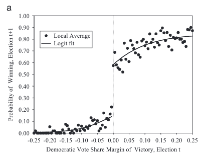

```{r child = here::here("_common-slides.Rmd"), cache = FALSE}

```

```{r packages, include=FALSE}
library(tidyverse)
library(patchwork)
library(here)
library(gganimate)

```

# Learning objectives

* Define logarithmic and exponential functions
* Practice simplifying power, logarithmic, and exponential functions
* Define sequences
* Distinguish convergence and divergence
* Define limits
* Define continuity
* Calculate limits of sequences and functions

---

# Logarithms and exponential functions

* Important component to many mathematical and statistical methods in social science
* Exponents
* Logarithms

---

# Functions with exponents

$$f(x) = x \times x = x^2$$

$$f(x) = x \times x \times x = x^3$$

```{r functions-with-exp}
{
  function_plot +
    stat_function(fun = function(x) x^2) +
    labs(title = expression(f(x) == x^2))
} + {
  function_plot +
    stat_function(fun = function(x) x^3) +
    labs(title = expression(f(x) == x^3))
}
```

---

# Common rules of exponents

* $x^0 = 1$
* $x^1 = x$
* $\left ( \frac{x}{y} \right )^a = \left ( \frac{x^a}{y^a}\right ) = x^a y^{-a}$
* $(x^a)^b = x^{ab}$
* $(xy)^a = x^a y^a$
* $x^a \times x^b = x^{a+b}$

---

# Logarithms

* Class of functions
* $\log_{b}(x) = a \Rightarrow b^a = x$
* What number $a$ solves $b^a = x$

---

# Base 10

$$\log_{10}(100) = 2 \Rightarrow 10^2 = 100$$

$$\log_{10}(0.1) = -1 \Rightarrow 10^{-1} = 0.1$$

```{r log-base-10}
function_plot +
  stat_function(fun = function(x) log(x, base = 10), n = 501) +
  coord_cartesian(xlim = c(0, 5)) +
  labs(
    title = expression(f(x) == log[10](x)),
    y = expression(f(x))
  )
```

---

# Base 2

$$\log_{2}(8) = 3 \Rightarrow 2^3 = 8$$

$$\log_{2}(1) = 0 \Rightarrow 2^0 = 1$$

```{r log-base-2}
function_plot +
  stat_function(
    mapping = aes(color = "10"),
    fun = function(x) log(x, base = 10), n = 501
  ) +
  stat_function(
    mapping = aes(color = "2"),
    fun = function(x) log(x, base = 2), n = 501
  ) +
  scale_color_brewer(type = "qual", labels = list(
    bquote(log[10](x)),
    bquote(log[2](x))
  )) +
  coord_cartesian(xlim = c(0, 5)) +
  labs(
    y = expression(f(x)),
    color = NULL
  )
```

---

# Base $e$

* Natural logarithm

$$\log_{e}(e) = 1 \Rightarrow e^1 = e$$

```{r log-base-e, fig.height = 5}
function_plot +
  stat_function(
    mapping = aes(color = "10"),
    fun = function(x) log(x, base = 10), n = 501
  ) +
  stat_function(
    mapping = aes(color = "2"),
    fun = function(x) log(x, base = 2), n = 501
  ) +
  stat_function(
    mapping = aes(color = "e"),
    fun = function(x) log(x), n = 501
  ) +
  scale_color_brewer(type = "qual", labels = list(
    bquote(log[10](x)),
    bquote(log[2](x)),
    bquote(log[e](x))
  )) +
  coord_cartesian(xlim = c(0, 5)) +
  labs(
    y = expression(f(x)),
    color = NULL
  )
```

* Natural logarithms are incredibly useful in math
* Often $\log()$ is assumed to be a natural log (good to assume for homework, too!)
* Also seen as $\ln()$

---

# Rules of logarithms

* $\log_b(1) = 0$
* $\log(x \times y) = \log(x) + \log(y)$
* $\log(\frac{x}{y}) = \log(x) - \log(y)$
* $\log(x^y) = y \log(x)$

---

# Sequence

* A sequence is a function whose domain is the set of positive integers
* We'll write a sequence as, 

$$\left\{u_{n} \right\}_{n=1}^{\infty} = (u_{1} , u_{2}, \ldots, u_{N}, \ldots )$$

---

# Sequence

$$\left\{\frac{1}{n} \right\} = (1, 1/2, 1/3, 1/4, \ldots, 1/N, \ldots, )$$

```{r seq-1, out.width="80%"}
tibble(
  x = seq(from = 1, to = 100),
  y = 1 / x
) %>%
  ggplot(aes(x, y)) +
  geom_point() +
  coord_cartesian(ylim = c(-1, 1) ) +
  labs(
    title = expression(f(n) == frac(1, n)),
    x = "Integers",
    y = "Sequence"
  ) +
  transition_manual(frames = x, cumulative = TRUE)
```

---

# Sequence

$$\left\{\frac{1}{n^2} \right\} = (1, 1/4, 1/9, 1/16, \ldots, 1/N^2, \ldots, )   \\$$

```{r seq-2, out.width="80%"}
tibble(
  x = seq(from = 1, to = 100),
  y = 1 / x^2
) %>%
  ggplot(aes(x, y)) +
  geom_point() +
  coord_cartesian(ylim = c(-1, 1)) +
  labs(
    title = expression(f(n) == frac(1, n^2)),
    x = "Integers",
    y = "Sequence"
  ) +
  transition_manual(frames = x, cumulative = TRUE)
```

---

# Sequence

$$\left\{\frac{1 + (-1)^n}{2} \right\} = (0, 1, 0, 1, \ldots, 0,1,0,1 \ldots, ) \\$$

```{r seq-3, out.width="80%"}
tibble(
  x = seq(from = 1, to = 100),
  y = (1 + (-1)^x) / 2
) %>%
  ggplot(aes(x, y)) +
  geom_point() +
  coord_cartesian(ylim = c(0, 1)) +
  labs(
    title = expression(f(n) == frac(1 + (-1)^n, 2)),
    x = "Integers",
    y = "Sequence"
  ) +
  transition_manual(frames = x, cumulative = TRUE)
```

---

# Arithmetic progression

* A sequence $\{ u_n \}$ with the property that the difference between each pair of successive terms is the same
    * $u_{n+1} - u_n$ is the same for all $n$
* The arithmetic progression with first term $a$ and common difference $d$ is

    $$a, a + d, a + 2d, a +3d, \ldots$$
  
* The $n$th term is given by

    $$u_n = a + (n-1)d$$

---

# Arithmetic progression

```{r arithmetric-progression, out.width="80%"}
# {
#   tibble(
#     x = seq(from = 1, to = 100),
#     y = 2 * x
#   ) %>%
#     ggplot(aes(x, y)) +
#     geom_point() +
#     labs(
#       title = expression(f(n) == 2 * n),
#       subtitle = expression(paste(a == 2, ", ", d == 2)),
#       x = "Integers",
#       y = "Sequence"
#     )
# } + {
#   tibble(
#     x = seq(from = 1, to = 100),
#     y = 29 - 9 * x
#   ) %>%
#     ggplot(aes(x, y)) +
#     geom_point() +
#     labs(
#       title = expression(f(n) == 29 - 9 * n),
#       subtitle = expression(paste(a == 20, ", ", d == -9)),
#       x = "Integers",
#       y = "Sequence"
#     )
# } +
#   plot_annotation(title = "Arithmetic progressions")
```

---

# Geometric progression

* A sequence $\{ u_n \}$ in which each term is obtained from the preceding one by multiplication by the same number:
    * The ratio $\frac{u_{n+1}}{u_n}$ is the same for all $n$
* The geometric progression with first term $a$ and common ratio $x$ is

    $$a, ax, ax^2, ax^3, \ldots$$
  
* The $n$th term is given by

    $$u_n = ax^{n-1}$$

---

# Geometric progression

```{r geometric-progression, out.width="80%"}
# {
#   tibble(
#     x = seq(from = 1, to = 20),
#     y = -3^x / 5
#   ) %>%
#     ggplot(aes(x, y)) +
#     geom_point() +
#     labs(
#       title = expression(f(n) == frac(-3^n, 5)),
#       subtitle = expression(paste(a == frac(-3, 5), ", ", x == 3)),
#       x = "Integers",
#       y = "Sequence"
#     )
# } + {
#   tibble(
#     x = seq(from = 1, to = 20),
#     y = 8 * (-4)^(1 - x)
#   ) %>%
#     ggplot(aes(x, y)) +
#     geom_point() +
#     labs(
#       title = expression(f(n) == 8 * (-4)^(1 - n)),
#       subtitle = expression(paste(a == 8, ", ", x == frac(-1, 4))),
#       x = "Integers",
#       y = "Sequence"
#     )
# } +
#   plot_annotation(title = "Geometric progressions")
```

---

# Convergence

$$\left\{\frac{(-1)^{n} }{n} \right \} = (-1, \frac{1}{2}, \frac{-1}{3}, \frac{1}{4}, \frac{-1}{5}, \frac{1}{6}, \frac{-1}{7}, \frac{1}{8}, \ldots )$$

```{r seq-convergence, out.width="80%"}
boundaries <- tibble(
  low = seq(from = -1, to = -0.01, by = 0.02),
  high = abs(low)
) %>%
  mutate(id = row_number())

ggplot() +
  geom_point(
    data = tibble(
      x = seq(from = 1, to = 200),
      y = (-1)^x / x
    ),
    mapping = aes(x, y)
  ) +
  geom_hline(data = boundaries, mapping = aes(yintercept = low, group = id)) +
  geom_hline(data = boundaries, mapping = aes(yintercept = high, group = id)) +
  coord_cartesian(ylim = c(-1, 1)) +
  labs(
    title = expression(f(n) == frac((-1)^n, n)),
    x = "Integers",
    y = "Sequence"
  ) + theme_minimal(base_size = 18) +
  transition_states(states = id, wrap = FALSE)
```

---

# Convergence

A sequence $\left\{u_{n} \right\}_{n=1}^{\infty}$ converges to a real number $A$ if for each $\epsilon >0$ there is a positive integer $N$ such that for all $n \geq N$ we have $|u_{n} - A| < \epsilon$ 

--

* If a sequence converges, it converges to **one** number $A$
* $\epsilon>0$ is some **arbitrary** real-valued number
* $N$ will depend upon $\epsilon$
* Implies the sequence never gets further than $\epsilon$ away from $A$

--

## Divergence and boundedness

* If a sequence $\left\{u_{n} \right\}$ converges we'll call it **convergent**
* If it doesn't we'll call it **divergent**
* If there is some number $M$ such that, for all $n$ $|u_{n}|<M$, then we'll call it **bounded**

---

# An unbounded sequence

$$\left\{ n \right \} = (1, 2, 3, 4, \ldots, N, \ldots )$$

```{r seq-unbounded}
tibble(
  x = seq(from = 1, to = 100),
  y = x
) %>%
  ggplot(aes(x, y)) +
  geom_point() +
  labs(
    title = expression(f(n) == n),
    x = "Integers",
    y = "Sequence"
  )
```

---

# A bounded sequence that doesn't converge

$$\left\{\frac{1 + (-1)^n}{2} \right\} = (0, 1, 0, 1, \ldots, 0,1,0,1 \ldots, )$$

```{r seq-bounded, fig.height = 5}
tibble(
  x = seq(from = 1, to = 100),
  y = (1 + (-1)^x) / 2
) %>%
  ggplot(aes(x, y)) +
  geom_point() +
  coord_cartesian(ylim = c(0, 1)) +
  labs(
    title = expression(f(n) == frac(1 + (-1)^n, 2)),
    x = "Integers",
    y = "Sequence"
  )
```

--

* All convergent sequences are bounded
* If a sequence is **constant**, $\left\{C \right \}$ it converges to $C$

---

# Algebra of sequences

Suppose $\left\{a_{n} \right \}$ converges to $A$ and $\left\{b_{n} \right\}$ converges to $B$. Then,

* $\left\{a_{n} + b_{n} \right\}$ converges to $A + B$
* $\left\{a_{n} b_{n} \right\}$ converges to $A \times B$
* Suppose $b_{n} \neq 0 \forall n$ and $B \neq 0$. Then $\left\{\frac{a_{n}}{b_{n}} \right\}$ converges to $\frac{A}{B}$

---

# Algebra of sequences

* Consider the sequence $\left\{\frac{1}{n} \right\}$ - what does it converge to?
* Consider the sequence $\left\{\frac{1}{2n} \right \}$ - what does it converge to?

--

```{r converge-similar-denominator}
function_plot +
  stat_function(
    fun = function(x) 1 / x,
    mapping = aes(color = "1 / x"),
    geom = "point"
  ) +
  stat_function(
    fun = function(x) 1 / (2 * x),
    mapping = aes(color = "1 / 2x"),
    geom = "point"
  ) +
  coord_cartesian(xlim=c(1, 10)) +
  scale_color_brewer(type = "qual", guide = guide_legend(reverse = TRUE)) +
  labs(color = NULL)
```

---

# Challenge questions

* What does $\left\{3 + \frac{1}{n}\right\}$ converge to?
* What about $\left\{ (3 + \frac{1}{n} ) (100  + \frac{1}{n^4} ) \right\}$?
* Finally, $\left\{ \frac{ 300 + \frac{1}{n} }{100  + \frac{1}{n^4}} \right\}$?

---

# Limits

* Sequences $\leadsto$ limits of functions
* Calculus/Real Analysis: study of functions on the **real line**
* Limit of a function: how does a function behave as it gets close to a particular point?  

--

## Uses of limits

* Derivatives
* Asymptotics 
* Game Theory 

---

# Limit of a function

```{r lim-sin-x, out.width="80%"}
sin_x <- tibble(
  xmin = seq(from = -1, to = 0, by = 0.025),
  xmax = abs(xmin),
  ymin = sin(xmin),
  ymax = sin(xmax)
) %>%
  mutate(id = row_number())

function_plot +
  stat_function(fun = sin) +
  coord_cartesian(xlim =c(-2, 2)) +
  labs(
    title = expression(f(x) == sin(x)),
    y = expression(f(x))
  ) +
  geom_segment(
    data = sin_x,
    mapping = aes(
      x = xmin,
      y = -2,
      xend = xmin,
      yend = ymin,
      group = id
    ),
    color = "blue"
  ) +
  geom_segment(
    data = sin_x,
    mapping = aes(
      x = xmax,
      y = -2,
      xend = xmax,
      yend = ymax,
      group = id
    ),
    color = "blue"
  ) +
  transition_states(states = id, wrap = FALSE)
```

---

# Limit of a function

* Suppose $f: \Re \rightarrow \Re$
* We say that $f$ has a limit $L$ at $x_{0}$ if, for $\epsilon>0$, there is a $\delta>0$ such that

    $$|f(x) - L| < \epsilon \, \forall \, x \backepsilon 0 < |x - x_0 | < \delta$$

--

$$|f(x) - L| < \epsilon \,$$ there's an epsilon larger than the distance between f(x) and the limit 

--
$$\forall \, x \backepsilon $$ for all x, such that,

--
$$0 < |x - x_0 | < \delta$$ the difference between x and $x_0$ bounded between 0 and some other delta (it ust be closer to 0 than $\delta$)


---

```{r out.width="100%"}
url <- "https://math.libretexts.org/@api/deki/files/9980/CNX_Calc_Figure_02_05_001.jpeg?revision=1"
knitr::include_graphics(url)

```

source: [math 210](https://math.libretexts.org/Courses/Monroe_Community_College/MTH_210_Calculus_I_%28Professor_Dean%29/Chapter_2_Limits/2.7%3A_The_Precise_Definition_of_a_Limit)


---

# Limits, cont'd

* Limits are about the behavior of functions at **points**. Here $x_{0}$
* As with sequences, we let $\epsilon$ define an **error rate**
* $\delta$ defines an area around $x_{0}$ where $f(x)$ is going to be within our error rate

---

# Examples of limits

* The function $f(x) = x + 1$ has a limit of $1$ at $x_{0} = 0$

```{r limit-xplus1, out.width="80%"}
function_plot +
  stat_function(fun = function(x) x + 1) +
  coord_cartesian(xlim=c(-2, 2)) +
  geom_point(data = tibble(
    x = 0, y = 1
  ), mapping = aes(x, y)) +
  labs(
    title = expression(f(x) == x + 1),
    y = expression(f(x))
  )
```

---

# Proof

* **Without loss of generalization** (WLOG) choose $\epsilon >0$
* Show that there is $\delta_{\epsilon}$ such that

    $$|f(x) - L| < \epsilon \, \text{for all} \, x \, \text{such that} \, 0 < |x - x_0 | < \delta$$

    $$\begin{aligned}|(x + 1) - 1| < \epsilon \, \text{for all} \, x \, &\text{such that} \, 0 < |x - 0 | < \delta \\|x| < \epsilon \, \text{for all} \, x \, &\text{such that} \, 0 < |x | < \delta \\\end{aligned}$$

--

* But if $\delta_{\epsilon}  = \epsilon$ then this holds

---

# $f(x_{0} ) \neq L$

* A function can have a limit of $L$ at $x_{0}$ even if $f(x_{0} ) \neq L$

--
* The function $f(x) = \frac{x^2 - 1}{x - 1}$ has a limit of $2$ at $x_{0} = 1$

```{r limit-discontinuous, out.width="80%"}
function_plot +
  stat_function(fun = function(x) (x^2 - 1) / (x - 1)) +
  coord_cartesian(xlim=c(-2, 2)) +
  labs(
    title = expression(f(x) == frac(x^2 - 1, x - 1)),
    y = expression(f(x))
  ) +
  geom_vline(xintercept = 1, linetype = 2, color = "blue", alpha = .5) +
  geom_hline(yintercept = 2, linetype = 2, color = "blue", alpha = .5)
```

---

# $f(x_{0} ) \neq L$

* For all $x \neq 1$,

    $$\begin{aligned}\frac{x^2 - 1}{x - 1} & = \frac{(x + 1)(x - 1) }{x - 1} \\													& = x + 1 \end{aligned}$$
  
* Choose $\epsilon >0$ and set $x_{0}=1$.  Then, we're looking for $\delta_{\epsilon}$ such that

    $$\begin{aligned}|(x + 1) -2 | < \epsilon \, \text{for all} \, x \, &\text{such that} \, 0 < |x - 1 | < \delta \\|x - 1 | < \epsilon \, \text{for all} \, x \, &\text{such that} \, 0 < |x - 1 | < \delta \\\end{aligned}$$

* If $\delta_{\epsilon} = \epsilon$, then this is satisfied

---

# Not all functions have limits

Consider $f:(0,1) \rightarrow \Re$, $f(x) = \frac{1}{x}$.  $f(x)$ does not have a limit at $x_{0}=0$ 

```{r limit-none, out.width="80%"}
function_plot +
  stat_function(fun = function(x) 1 / x, n = 1000) +
  coord_cartesian(xlim = c(0.001, 1)) +  # Use this to zoom safely
  labs(
    title = expression(f(x) == frac(1, x)),
    y = expression(f(x))
  )
```

---

# Not all functions have limits

* Choose $\epsilon>0$. We need to show that there **does not** exist

    $$\begin{aligned}|\frac{1}{x} - L| < \epsilon \, \text{for all} \, x \, &\text{such that} \, 0 < |x - 0 | < \delta \\|\frac{1}{x} - L| < \epsilon \, \text{for all} \, x \, &\text{such that} \, 0 < |x| < \delta \\\end{aligned}$$

* But, there is a problem

    $$\begin{aligned}\frac{1}{x} - L & < \epsilon \\\frac{1}{x} & < \epsilon + L \\x & > \frac{1}{L + \epsilon}  \end{aligned}$$
  
* This implies that there **can't** be a $\delta$

---
# When there are no limits!
```{r no-limit-img, out.width="80%"}
knitr::include_graphics("https://media.giphy.com/media/7JvlHfd7C2GDr7zfZF/giphy.gif")
```
--
When there is no limit, this has a lot of implications for us w/r/t (with respect to) how we can expect the function(s) to behave and what we can do with the function(s) mathematically.
---

# Intuitive definition of a limit

$$\lim_{x \rightarrow x_{0}} f(x) = L$$

--

## Right-hand limits

$$\lim_{x \rightarrow x_{0}^{+} } f(x) = L$$

--

## Left-hand limits

$$\lim_{x \rightarrow x_{0}^{-} } f(x) = L$$

---

# Algebra of limits

Suppose $f:\Re \rightarrow \Re$ and $g: \Re \rightarrow \Re$ with limits $A$ and $B$ at $x_{0}$. Then,

$$
\begin{aligned}
\text{i.) } \lim_{x \rightarrow x_{0} } (f(x) + g(x) ) & = \lim_{x \rightarrow x_{0}} f(x) + \lim_{x \rightarrow x_{0}} g(x)  = A + B \\
\text{ii.) }\lim_{x \rightarrow x_{0} } f(x) g(x) & = \lim_{x \rightarrow x_{0}} f(x) \lim_{x\rightarrow x_{0}} g(x)  = A B 
\end{aligned}
$$

--

Suppose $g(x) \neq 0$ for all $x \in \Re$ and $B \neq 0$ then $\frac{f(x)}{g(x)}$ has a limit at $x_{0}$ and

$$\lim_{x \rightarrow x_{0}} \frac{f(x)}{g(x)} =  \frac{\lim_{x\rightarrow x_{0} } f(x) }{\lim_{x \rightarrow x_{0} } g(x) } = \frac{A}{B}$$

---

# Continuity

```{r continuity, fig.height = 6}
function_plot +
  stat_function(fun = function(x) (x^2 - 1) / (x - 1)) +
  coord_cartesian(xlim=c(-2, 2)) +
  labs(
    title = expression(f(x) == frac(x^2 - 1, x - 1)),
    y = expression(f(x))
  )
```

* Limit exists at 1 
* But hole in function 
* Fails the **pencil** test, **discontinuous** at 1

---

# Defining continuity

* Suppose $f:\Re \rightarrow \Re$ and consider $x_{0} \in \Re$
* $f$ is continuous at $x_{0}$ if for each $\epsilon>0$ there is a $\delta>0$ such that if,

    $$\begin{aligned}|x - x_{0} | & < \delta \text{ for all  } x \in \Re \text{ then } \nonumber \\|f(x) - f(x_{0})| & < \epsilon \nonumber \end{aligned}$$

--

* Previously $f(x_{0})$ was replaced with $L$
* Now: $f(x)$ has to converge on itself at $x_{0}$
* **Continuity is more restrictive than limit**

---

# Examples of continuity

```{r continuity-abs, out.width="80%"}
function_plot +
  stat_function(fun = abs) +
  labs(
    title = expression(f(x) == abs(x)),
    y = expression(f(x))
  ) +
  coord_cartesian(xlim=c(-2, 2))
```

---

# Examples of continuity

```{r continuity-cos, out.width="80%"}
function_plot +
  stat_function(fun = cos) +
  labs(
    title = expression(f(x) == cos(x)),
    y = expression(f(x))
  ) +
  coord_cartesian(xlim=c(-6, 6))
```

---

# Examples of continuity

```{r continuity-x-sq, out.width="80%"}
function_plot +
  stat_function(fun = function(x) x^2) +
  labs(
    title = expression(f(x) == x^2),
    y = expression(f(x))
  )
```

---

# Measuring incumbency advantage

* Incumbency advantage
* U.S. House of Representatives
* Win rate of incumbent parties $>90\%$
* Win rate of incumbent candidates $\approx 90\%$ (conditional on running for election)
    * $88\%$ probability of running for reelection
--
* Runners-up
    * $3\%$ chance of winning the next election
    * Only $20\%$ chance of running in the next election
* Is there an electoral advantage to incumbency?
* Can this be proven through observational study?

---

# Ideal experiment

* Randomly assign incumbent parties in a district between Democrats and Republicans
* Keep all other factors constant
* Corresponding increase in Democratic electoral success in the next election would represent the overall electoral benefit due to being the incumbent party in the district
* Realistic?

---

# Regression discontinuity design

* Dichotomous treatment is a deterministic function of a single, continuous covariate
* Treatment is assigned to those individuals whose score crosses a known threshold
* If you know the score, you can reverse-engineer the treatment assignment
* Assumes as-if random assignment in the local neighborhood around a probability of $50\%$

---

# RDD + incumbency advantage

```{r rdd-img", out.width="80%"}

```

Source: [Lee, D. S. (2008). Randomized experiments from non-random selection in US House elections. *Journal of Econometrics*, 142(2), 675-697.](https://www.sciencedirect.com/science/article/pii/S0304407607001121)

---

# Continuity and limits

* Let $f: \Re \rightarrow \Re$ with $x_{0} \in \Re$
* Then $f$ is continuous at $x_{0}$ if and only if $f$ has a limit at $x_{0}$ and that $\lim_{x \rightarrow x_{0} } f(x) = f(x_{0})$
--

* Suppose $f$ is continuous at $x_{0}$
    * This implies that $|f(x) - f(x_0)| < \epsilon \, \text{for all} \, x \, \text{such that} \, |x - x_0 | < \delta$
    * Definition of a **limit**, with $L = f(x_{0})$
--

* Suppose $f$ has a limit at $x_{0}$ and that limit is $f(x_{0})$
    * This implies that $|f(x) - f(x_0)| < \epsilon \, \text{for all} \, x \, \text{such that} \, |x - x_0 | < \delta$
    * This is the definition of **continuity**

---

# Algebra of continuous functions

Suppose $f:\Re \rightarrow \Re$ and $g:\Re \rightarrow \Re$ are continuous at $x_{0}$. Then,

1. $f(x) + g(x)$ is continuous at $x_{0}$
1. $f(x) g(x)$ is continuous at $x_{0}$
1. If $g(x_0) \neq 0$, then $\frac{f(x) } {g(x) }$ is continuous at $x_{0}$ 


---
class: center, middle, inverse

# RECAP


---
# Today's concepts:

* Sequences
  * arithmetic 
  * geometric
  * logs
  * convergence 
* Limits
  * continuity
  * what they tell us
  * how to find them
  
---
# NEXT UP!

* DERIVATIVES!!!!!!!!
* Check in with any questions! (clipperton@uchicago.edu)


### TA TEAM!
* Bailey Meche baileymeche@uchicago.edu
* Gabe Reichman gabereichman@uchicago.edu
* Shirley Zhang xueyan1220@uchicago.edu
* Stanley Yi yijiaying@uchicago.edu

---
class: center, middle, inverse
## (Students) Let’s get to know each other a bit more – Name, pronouns, subfield/research area, where you are currently, something fun/interesting about you and/or your hobbies

  
