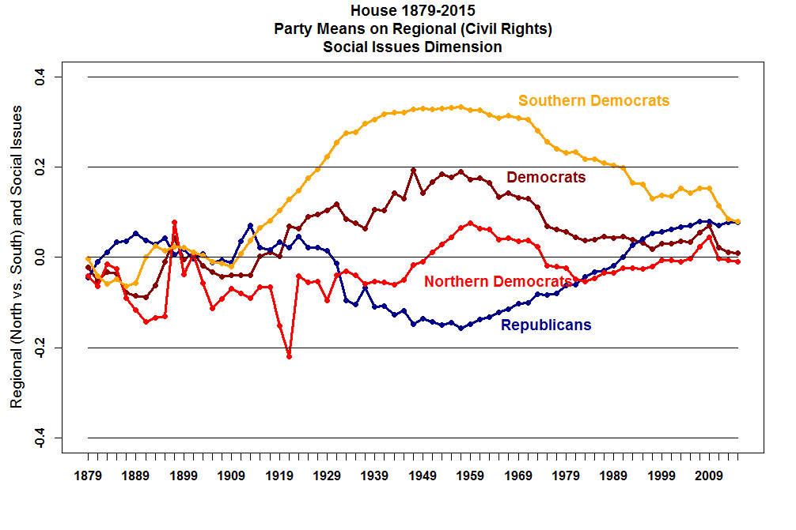
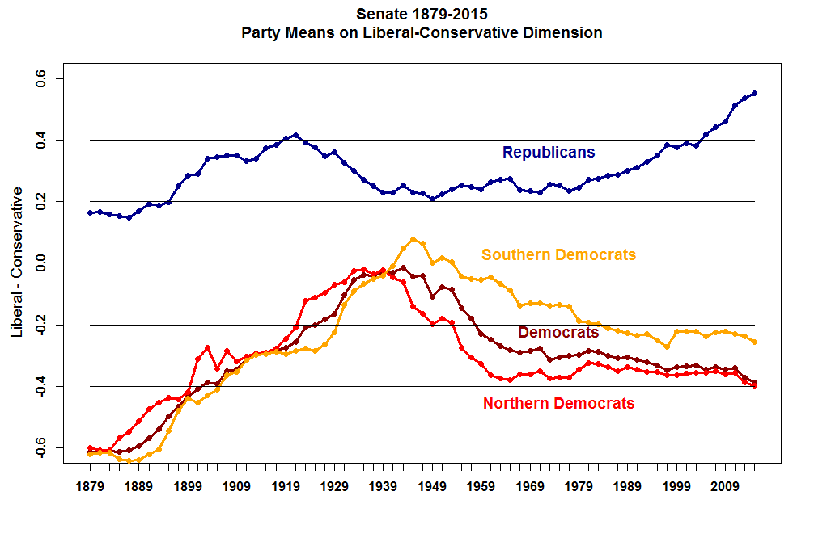

```{r child = here::here("_common-slides.Rmd"), cache = FALSE}

```

```{r packages, include=FALSE}
library(tidyverse)
library(patchwork)
library(here)
library(gganimate)
library(broom)
```

# Learning objectives

* Matrix transposition 
* Our pal, the diagonal: trace and determinant 
* Define matrix inversion
* Demonstrate how to solve systems of linear equations using matrix inversion
* Define the determinant of a matrix
* Define matrix decomposition
* Explain singular value decomposition and demonstrate the applicability of matrix algebra to real-world problems

---

# Matrix transposition

Transposing a matrix means *flipping* it in a sense -- swapping across the diagonal. 

$$\mathbf{X} = \begin{pmatrix} x_{11} & x_{12} & \ldots & x_{1n} \\ x_{21} & x_{22} & \ldots & x_{2n} \\ \vdots & \vdots & \ddots & \vdots \\ x_{m1} & x_{m2} & \ldots & x_{mn} \\ \end{pmatrix}$$ 

$$\mathbf{X}' = \begin{pmatrix}  x_{11} & x_{21} & \ldots & x_{m1} \\ x_{12} & x_{22} & \ldots & x_{m2} \\ \vdots & \vdots & \ddots & \vdots \\ x_{1n} & x_{2n} & \ldots & x_{mn}\end{pmatrix}\\$$

---
# Diagonal measures: trace and determinant

* **Trace** gives us information about the magnitude of the diagonal of a matrix: you simply add the values along the diagonal. 
  * For example, the trace of an identity matrix is equal to the number of rows (e.g.: $tr(\mathbf{I}_2)=2$ )

* **Determinant**: summarizes structure of entire matrix. Easy for $2\times 2$ matrix but a pain for larger ones.
  * **submatrix**: akin to a subset: smaller matrix from original when deleting a row / column
  * **minor**: determinant of submatrix (relates to deleting particular row/column)
  * **cofactor**: product of minor and signed element removed from the matrix
---

# Determinant

* Single number summary of a square matrix
* Summary of structure: helps us understand (loosely speaking) how much space our vectors are taking up (more on this soon!)
* Complicated to calculate: generally, multiply down the diagonal and subtract products along opposite diagonal (examples coming!)
* Referred to using single bars $|\mathbf{X}|$ or $det(\mathbf{X}$ )


---

# $2 \times 2$ matrix

$$\det(\mathbf{X}) = \mid \mathbf{X} \mid = \left| \begin{matrix}
x_{11} & x_{12} \\
x_{21} & x_{22}
\end{matrix} \right| = x_{11}x_{22} - x_{12}x_{21}$$

--

$$\left| \begin{matrix}
1 & 2 \\
3 & 4
\end{matrix} \right| = (1)(4) - (2)(3) = 4 - 6 = -2$$

--
$$\left| \begin{matrix}
10 & \frac{1}{2} \\
4 & 1
\end{matrix} \right| = (10)(1) - \left( \frac{1}{2} \right)(4) = 10 - 2 = 8$$

--

$$\left| \begin{matrix}
2 & 3 \\
6 & 9
\end{matrix} \right| = (2)(9) - (3)(6) = 18 - 18 = 0$$

* Pay attention to if/when the determinant is zero!

---

# $n \times n$ matrix: the submatrix
Unfortunately calculating determinants gets much more involved with square matrices larger than $2 \times 2$. First we need to define a **submatrix**. The submatrix is simply a form achieved by deleting rows and/or columns of a matrix, leaving the remaining elements in their respective places. So for the matrix $\mathbf{X}$, notice the following submatrices:


$$\mathbf{X} = \begin{bmatrix} x_{11} & x_{12} & x_{13} & x_{14} \\
x_{21} & x_{22} & x_{23} & x_{24} \\
x_{31} & x_{32} & x_{33} & x_{34} \\
x_{41} & x_{42} & x_{43} & x_{44} \\
\end{bmatrix}$$

$$\mathbf{X}_{[11]} = \begin{bmatrix}
x_{22} & x_{23} & x_{24} \\
x_{32} & x_{33} & x_{34} \\
x_{42} & x_{43} & x_{44} \\
\end{bmatrix},
\mathbf{X}_{[24]} = \begin{bmatrix}
x_{11} & x_{12} & x_{13}  \\
x_{31} & x_{32} & x_{33}  \\
x_{41} & x_{42} & x_{43}  \\
\end{bmatrix}$$

---

# $n \times n$ matrix

$$\mid \mathbf{X} \mid = \sum_{j=1}^n (-1)^{i+j} x_{ij} \mid\mathbf{X}_{[ij]}\mid$$
  * NOTE: we can add across any one row or column (just be consistent)

* $ij$th **minor** of $\mathbf{X}$ for $x_{ij}$, $\mid\mathbf{X}_{[ij]}\mid$
    * Determinant of the $(n - 1) \times (n - 1)$ submatrix that results from taking the $i$th row and $j$th column out
    * Refer to this resulting submatrix at $\mathbf{M_{ij}}$
* **Cofactor** of $\mathbf{X}$
    * Minor signed as $(-1)^{i+j}\mid\mathbf{X}_{[ij]}\mid$
* Cycle recursively through columns

---

# Determinant: $3 \times 3$ matrix

$$\begin{aligned}
\mathbf{X} &= \begin{bmatrix}
x_{11} & x_{12} & x_{13} \\
x_{21} & x_{22} & x_{23} \\
x_{31} & x_{32} & x_{33} \\
\end{bmatrix} \\
\det(\mathbf{X}) &= (-1^{1+1})x_{11} \left| \begin{matrix}
x_{22} & x_{23} \\
x_{32} & x_{33} \\
\end{matrix} \right| +(-1^{1+2})x_{12} \left| \begin{matrix}
x_{21} & x_{23} \\
x_{31} & x_{33} \\
\end{matrix} \right| + (-1^{1+3})x_{13} \left| \begin{matrix}
x_{21} & x_{22} \\
x_{31} & x_{32} \\
\end{matrix} \right|\end{aligned}$$
$$= (-1)^2x_{11}\mathbf{M_{11}}+(-1)^3x_{12}\mathbf{M_{12}}+(-1)^4x_{13}\mathbf{M_{13}}$$
--
NO YOU DO NOT NEED TO BE ABLE TO DO THIS GENERALLY (just for the homework today!)


---

# Cofactor matrix

You can also create the cofactor matrix using your work from the determinant work on the prior slide:

$$\mathbf{C}_{ij}=(-1)^{i+j}\mathbf{M}_{ij}$$
---
# Example: $3 \times 3 matrix$

$$\begin{aligned}\begin{bmatrix}1 & 2 & 3 \\ 
2 & 1 & 3 \\ 
4 & 1 & 2\end{bmatrix}\end{aligned}$$
* Compose into smaller sub-matrices
* Find cofactors
* Find determinant of each submatrix
* Create cofactor matrix
* Find determinant

---

# Answer: $3 \times 3 matrix$

$$\begin{aligned}\begin{bmatrix}1 & 2 & 3 \\ 2 & 1 & 3 \\ 4& 1 & 2\end{bmatrix}\end{aligned}$$
* Compose into smaller sub-matrices
* Find determinant of each submatrix

$\mathbf{M_{11}} = \left|\begin{bmatrix} 1 & 3 \\ 1 & 2 \end{bmatrix}\right|= 2-3 =-1$;
$\mathbf{M_{12}} = \left|\begin{bmatrix} 2 &  3\\ 4 &2  \end{bmatrix}\right|=4-12=-8$;
$\mathbf{M_{13}} = \left|\begin{bmatrix}  2 &1  \\ 4 &1  \end{bmatrix}\right|=2-4=-2$;
$\mathbf{M_{21}} = \left|\begin{bmatrix}2  &3  \\ 1 &2  \end{bmatrix}\right|=4-3=1$;
$\mathbf{M_{22}} = \left|\begin{bmatrix} 1 & 3 \\ 4 & 2 \end{bmatrix}\right|=2-12=-10$;
$\mathbf{M_{23}} = \left|\begin{bmatrix}1  &2  \\ 4 & 1 \end{bmatrix}\right|=1-8=-7$;
$\mathbf{M_{31}} = \left|\begin{bmatrix} 2 & 3 \\ 1 & 3 \end{bmatrix}\right|=6-3=3$;
$\mathbf{M_{32}} = \left|\begin{bmatrix}  1&3  \\ 2 & 3 \end{bmatrix}\right|=3-6=-3$;
$\mathbf{M_{33}} = \left|\begin{bmatrix}  1& 2 \\ 2 & 1 \end{bmatrix}\right|=1-4=-3$

---
# Answer: $3 \times 3 matrix$
* Create cofactor matrix
$$\begin{aligned}\begin{bmatrix}
1 \mathbf{M_{11}} & -1\mathbf{M_{12}} & 1\mathbf{M_{13}} \\
-1 \mathbf{M_{21}}& 1\mathbf{M_{22}} & -1\mathbf{M_{23}} \\
1 \mathbf{M_{31}}& -1\mathbf{M_{32}} & 1\mathbf{M_{33}}
\end{bmatrix}\end{aligned}$$

$$\begin{aligned}\begin{bmatrix}
1 (-1) & -1(-8) & 1 (-2) \\
-1 (1)& 1(-10)  & -1 (-7) \\
1 (3) & -1(-3)  & 1 (-3)
\end{bmatrix} = \begin{bmatrix}
-1 & 8& -2 \\
-1& -10  & -7 \\
3 & 3  & -3
\end{bmatrix}\end{aligned}$$
---

# Answer: $3 \times 3 matrix$

$$\mid \mathbf{X} \mid = \sum_{j=1}^n (-1)^{i+j} x_{ij} \mid\mathbf{X}_{[ij]}\mid$$

Let's live life on the edge and each compute the determiniant differently. I will show TWO examples: row two and column three (EXCITEMENT!). 

--

Recall that what we do is we basically choose a row or column, and then multiply the corresponding row/column from the original matrix. 

---
# Example: row (i =2)
$$\begin{aligned}\mathbf{A}=
\begin{bmatrix}1 & 2 & 3 \\ 
2 & 1 & 3 \\ 
4 & 1 & 2\end{bmatrix}, 
\mathbf{C} =\begin{bmatrix}
-1 & 8& -2 \\
-1& -10  & 7 \\
3 & 3  & -3
\end{bmatrix}\end{aligned}$$

Determinant: 
$$\begin{aligned}
|\mathbf{A}|&=a_{21}\mathbf{C_{21}}+ a_{22}\mathbf{C_{22}} + a_{23}\mathbf{C_{23}}\\
&=2*-1+1*-10+3*7\\
&=-2-10+21\\
&=9 \end{aligned}$$

-- 

Alternatively, for $3 x 3$ ONLY: $det(\mathbf{A}) = a11a22a33 − a_{11}a_{23}a_{32} − a_{12}a_{21}a_{33} +a_{12}a_{23}a_{31} + a_{13}a_{21}a_{32} − a_{13}a_{22}a_{31}$

---
# Example: column (j = 2)
$$\begin{aligned}\mathbf{A}=
\begin{bmatrix}1 & 2 & 3 \\ 
2 & 1 & 3 \\ 
4 & 1 & 2\end{bmatrix}, 
\mathbf{C} =\begin{bmatrix}
-1 & 8& -2 \\
-1& -10  & 7 \\
3 & 3  & -3
\end{bmatrix}\end{aligned}$$

Determinant: 
$$\begin{aligned}|\mathbf{A}|
&=a_{21}\mathbf{C_{21}}+ a_{22}\mathbf{C_{22}} + a_{23}\mathbf{C_{23}} \\
&=2*8 + 1*-10+1*3\\
&=16-10+3 \\
&=9\end{aligned}$$
---
## Determinants, Minors, Cofactors

Help you break down the matrix, learn about its components, get a sense of it in space. 

* Zero determinant is important (ominous foreshadowing)

---

class: middle, inverse, center

# Inverting matrices

---

#Why is this useful? Matrix inversion is necessary to:

* Solve systems of equations
* Perform linear regression
* Provide intuition about **colinearity**, **fixed effects**, and other relevant design matrices for social scientists.


---


# Matrix inversion
The inverse of a matrix is akin to dividing by itself (although since these are matrices, it's obviously more complicated than just dividing!)

--

* $\mathbf{X}$ is an $n \times n$ matrix
* Find the matrix $\mathbf{X}^{-1}$ such that 

    $$\mathbf{X}^{-1} \mathbf{X} = \mathbf{X} \mathbf{X}^{-1} = \mathbf{I}$$

  where $\mathbf{I}$ is the $n \times n$ identity matrix

--

If $\mathbf{A} = \begin{bmatrix} a & b \\ c & d \end{bmatrix}$ and $ad \neq bc$, then $\mathbf{A}$ is invertible and

$$\mathbf{A}^{-1} = \frac{1}{ad - bc} \begin{bmatrix}
d & -b \\
-c & a
\end{bmatrix}$$

---
# Simple matrix inversion example:
For example

$$\begin{aligned}
\mathbf{A} &= \begin{bmatrix}
9 & 7 \\
2 & 1
\end{bmatrix} \\
\mathbf{A}^{-1} &= \frac{1}{(-5)} \begin{bmatrix}
1 & -7 \\
-2 & 9
\end{bmatrix} = \begin{bmatrix}
-0.2 & 1.4 \\
0.4 & -1.8
\end{bmatrix}
\end{aligned}$$

We can verify by

$$\mathbf{A}^{-1} \mathbf{A} = \begin{bmatrix}
9 & 7 \\
2 & 1
\end{bmatrix} \begin{bmatrix}
-0.2 & 1.4 \\
0.4 & -1.8
\end{bmatrix} = \begin{bmatrix}
1 & 0 \\
0 & 1
\end{bmatrix} = \mathbf{I}$$


---

# Calculating matrix inversions

$$\begin{aligned}
x_{1} + x_{2} + x_{3} &= 0 \\
0x_{1} 	+ 	5x_{2} + 0x_{3}  & = 5 \\
0 x_{1} + 0 x_{2} + 3 x_{3} & =  6 \\
\end{aligned}$$

--

$$\begin{aligned}
\mathbf{A}  &= \begin{bmatrix} 1 & 1 & 1 \\ 0 & 5 & 0 \\ 0 & 0 & 3 \end{bmatrix} \\
\mathbf{x} &= (x_{1} , x_{2}, x_{3} ) \\
\mathbf{b} &= (0, 5, 6)
\end{aligned}$$

* System of equations

    $$\mathbf{A}\mathbf{x} =\mathbf{b}$$

* $\mathbf{A}^{-1}$ exists **if and only if** $\mathbf{A}\mathbf{x}  =  \mathbf{b}$ has only one solution

---

# Invertible matrices

* Suppose $\mathbf{X}$ is an $n \times n$ matrix
* Call $\mathbf{X}^{-1}$ the **inverse** of $\mathbf{X}$ if

    $$\mathbf{X}^{-1} \mathbf{X} = \mathbf{X} \mathbf{X}^{-1} = \mathbf{I}$$

* If $\mathbf{X}^{-1}$ exists then $\mathbf{X}$ is invertible
* If $\mathbf{X}^{-1}$ does not exist, $\mathbf{X}$ is **singular**

---

# Inverting a matrix

    
```{r matrix-inverse}
A <- matrix(c(1, 1, 1, 0, 5, 0, 0, 0, 3),
  nrow = 3,
  ncol = 3, byrow = TRUE
)
print(A)

b <- c(0, 5, 6)

print("inverse of A")
solve(A) # inverse of A
# solve(A) %*% A # verify inverse times itself is identity matrix
# solve(A, b)   # inverse of A times y = x
```

--

* $\mathbf{x}$
    
```{r matrix-solve, dependson = "matrix-inverse"}
solve(A, b)
```

---

# When do inverses exist

* Linear independence

--

Remember when our determinant was zero? 
$$\left| \begin{matrix}
2 & 3 \\
6 & 9
\end{matrix} \right| = (2)(9) - (3)(6) = 18 - 18 = 0$$

Here, we can see that our two vectors are not linearly independent.(for example, try $x=-3, y=2$) 

--

Thus, our determinant is zero. If we don't have linear independence, we can't take an inverse (singular matrix). [THIS IS WHY WE CARE ABOUT COLLINEARITY!]

---

# Inverse matrices examples: 

### Example 1

$$\mathbf{v}_{1} = (1, 0, 0), \quad \mathbf{v}_{2} = (0,1,0), \quad \mathbf{v}_{3} = (0,0,1)$$
Thus, we can consider these vectors as linearly independent and check to see whether they are invertible. (surprise: it is...but returns itself!)
--

### Example 2

$$\mathbf{v}_{1} = (1, 0, 0), \quad \mathbf{v}_{2} = (0,1,0), \quad \mathbf{v}_{3} = (0,0,1), \quad \mathbf{v}_{4} = (1, 2, 3)$$

--

$$\mathbf{v}_{4} = \mathbf{v}_{1} + 2 \mathbf{v}_{2} + 3\mathbf{v}_{3}$$
--
In this situation, we would want to combine these into a matrix. However, if we wanted to do transformations, a) the matrix is not square and b) because they are linearly dependent, our determinant would be zero even if we *could* calculate it (but we can't). 
---

# Inverting a $2 \times 2$ matrix

* If $\mathbf{A} = \begin{bmatrix} a & b \\ c & d \end{bmatrix}$ and $ad \neq bc$, then $\mathbf{A}$ is invertible and

    $$\mathbf{A}^{-1} = \frac{1}{ad - bc} \begin{bmatrix}d & -b \\-c & a\end{bmatrix}$$
    
  --
$$\mathbf{A}^{-1} = \frac{1}{det(\mathbf{A})} \begin{bmatrix}d & -b \\-c & a\end{bmatrix}$$
---

# Inverting a $2 \times 2$ matrix

$$\mathbf{A} = \begin{bmatrix}9 & 7 \\2 & 1\end{bmatrix} \\\mathbf{A}^{-1} = \frac{1}{(-5)} \begin{bmatrix}1 & -7 \\-2 & 9\end{bmatrix} = \begin{bmatrix}-0.2 & 1.4 \\0.4 & -1.8\end{bmatrix}$$

--

## Verification

$$\mathbf{A}^{-1} \mathbf{A} = \begin{bmatrix}9 & 7 \\2 & 1\end{bmatrix} \begin{bmatrix}-0.2 & 1.4 \\0.4 & -1.8\end{bmatrix} = \begin{bmatrix}1 & 0 \\0 & 1\end{bmatrix} = \mathbf{I}$$

---

# Inverting an $n \times n$ matrix
(this gets much less pleasant)

--
* Gauss-Jordan elimination
* Augmented matrix
* Elementary row operations (do in to get the identity on the left)
    1. Exchanging two rows in the matrix
    1. Subtracting a multiple of one row from another row
* Obtain a diagonal matrix


---

# Example of Gauss-Jordan

$$\mathbf{A} = \begin{bmatrix}
2 & 1 & 2 \\
3 & 1 & 1 \\
3 & 1 & 2
\end{bmatrix}$$

##### Setup the augmented matrix

$$\left[\begin{array}{rrr|rrr}2 & 1 & 2 & 1 & 0 & 0 \\3 & 1 & 1 & 0 & 1 & 0 \\3 & 1 & 2 & 0 & 0 & 1\end{array}\right]$$

##### Substract $3/2$ times the first row from each of the other rows

$$\left[\begin{array}{rrr|rrr}2 & 1 & 2 & 1 & 0 & 0 \\0 & -1/2 & -2 & -3/2 & 1 & 0 \\0 & -1/2 & -1 & -3/2 & 0 & 1\end{array}\right]$$

---

# Example of Gauss-Jordan

##### Substract $3/2$ times the first row from each of the other rows

$$\left[\begin{array}{rrr|rrr}2 & 1 & 2 & 1 & 0 & 0 \\0 & -1/2 & -2 & -3/2 & 1 & 0 \\0 & -1/2 & -1 & -3/2 & 0 & 1\end{array}\right]$$

##### Add twice the second row to the first row, and subtract the second row from the third row

$$\left[\begin{array}{rrr|rrr}2 & 0 & -2 & -2 & 2 & 0 \\0 & -1/2 & -2 & -3/2 & 1 & 0 \\0 & 0 & 1 & 0 & -1 & 1\end{array}\right]$$

---

# Example of Gauss-Jordan

##### Add twice the second row to the first row, and subtract the second row from the third row

$$\left[\begin{array}{rrr|rrr}2 & 0 & -2 & -2 & 2 & 0 \\0 & -1/2 & -2 & -3/2 & 1 & 0 \\0 & 0 & 1 & 0 & -1 & 1\end{array}\right]$$

##### Add twice the third row to the first and second rows

$$\left[\begin{array}{rrr|rrr}2 & 0 & 0 & -2 & 0 & 2 \\0 & -1/2 & 0 & -3/2 & -1 & 2 \\0 & 0 & 1 & 0 & -1 & 1\end{array}\right]$$
    
---

# Example of Gauss-Jordan

##### Add twice the third row to the first and second rows

$$\left[\begin{array}{rrr|rrr}2 & 0 & 0 & -2 & 0 & 2 \\0 & -1/2 & 0 & -3/2 & -1 & 2 \\0 & 0 & 1 & 0 & -1 & 1\end{array}\right]$$
--

##### Norm out the diagonal matrix to be $\mathbf{I}$
$$\left[\begin{array}{rrr|rrr}1 & 0 & 0 & -1 & 0 & 1 \\0 & 1 & 0 & 3  & -2 & -4 \\0 & 0 & 1 & 0 & -1 & 1\end{array}\right]$$
--
    
$$\mathbf{A}^{-1} = \begin{bmatrix}-1 & 0 & 1 \\3 & 2 & -4 \\0 & -1 & 1\end{bmatrix}$$

---

# Another example 

$$\mathbf{A} = \begin{bmatrix}
1 & 3 & 5 \\
1 & 7 & 2 \\
1 & 4 & 5
\end{bmatrix}$$

--

##### First setup the augmented matrix

$$\left[\begin{array}{rrr|rrr}1 & 3 & 5 & 1 & 0 & 0 \\1 & 7 & 2 & 0 & 1 & 0 \\1 & 4 & 5 & 0 & 0 & 1\end{array}\right]$$
--
##### Subtract row 3 from row 2 and row 1 from row 3:

$$\left[\begin{array}{rrr|rrr}1 & 3 & 5 & 1 & 0 & 0 \\0 & 3 & -3 & 0 & 1 & -1 \\0 & 1 & 0 & -1 & 0 & 1\end{array}\right]$$
    
---

# Another example 

##### Subtract row 2 from row 1; divide row 2 by 3; add rows 2 and 3

$$\left[\begin{array}{rrr|rrr}1 & 0 & 8 & 1 & -1 & 1 \\0 & 1 & -1 & 0 & \frac{1}{3} & -\frac{1}{3} \\ 0 & 0 & 1 & -1 & -\frac{1}{3} & \frac{4}{3}\end{array}\right]$$
    
##### Subtract 8 * row 3 from row 1; add row 2 to row 3

$$\left[\begin{array}{rrr|rrr}1 & 0 & 0 & 9 & \frac{5}{3} & -\frac{29}{3} \\
0 & 1 & 0 & -1 & 0 & 1 \\ 0 & 0 & 1 & -1 & -\frac{1}{3} & \frac{4}{3}\end{array}\right]$$

--

We found it!


---

# Alternative: Inverse matrix

$$\frac{1}{det(A)}C^T$$

Where $C^T$ is the *transpose of the cofactor matrix* (aka adjoint matrix)

Note: by hand, really a $3\times 3$ matrix is the absolute limit for finding an inverse, but even that can be quite time consuming. While we show you how to do this, you will likely never need to do this beyond a 'proof of concept' demonstration.

---

# Application: Regression analysis
In some methods/quantitative classes you learn about linear regression. For each $i$ (individual) we observe covariates $x_{i1}, x_{i2}, \ldots, x_{ik}$ and dependent variable $Y_{i}$. Then,

$$\begin{aligned}
Y_{1} & = \beta_{0} + \beta_{1} x_{11} + \beta_{2} x_{12} + \ldots + \beta_{k} x_{1k} \\
Y_{2} & = \beta_{0} + \beta_{1} x_{21} + \beta_{2} x_{22} + \ldots + \beta_{k} x_{2k} \\
\vdots & \vdots & \vdots \\
Y_{i} & = \beta_{0} + \beta_{1} x_{i1} + \beta_{2} x_{i2} + \ldots + \beta_{k} x_{ik} \\
\vdots & \vdots & \vdots \\
Y_{n} & = \beta_{0} + \beta_{1} x_{n1} + \beta_{2} x_{n2} + \ldots + \beta_{k} x_{nk}
\end{aligned}$$

* $\mathbf{x}_{i} = (1, x_{i1}, x_{i2}, \ldots, x_{ik})$

 $\mathbf{Y} = \begin{bmatrix}Y_{1} \\ Y_{2} \\  \vdots \\ Y_{n}\end{bmatrix}$, 
 $\boldsymbol{\beta} = \begin{bmatrix}\beta_{0} \\ \beta_{1} \\ \vdots \\ \beta_{k} \end{bmatrix}$,$\mathbf{X} = \begin{bmatrix} \mathbf{x}_{1}\\\mathbf{x}_{2}\\ \vdots \\ \mathbf{x}_{n} \end{bmatrix}$

---

# Solve the system of equations

GOAL: find $\beta$
$$\begin{aligned}
\mathbf{Y} &= \mathbf{X}\mathbf{\beta} \\\end{aligned}$$


* Ok, so, we have an $\mathbf{X}$. We want to 'undo' it, so we need the inverse. Is it invertible? How do we make sure? 

--

* Ah, yes, we multiply it by its transpose. It will certainly be square (and likely invertible) then

$$\begin{aligned}
\mathbf{X}^{'} \mathbf{Y} &= \mathbf{X}^{'} \mathbf{X} \mathbf{\beta} \\\end{aligned}$$

--
* Great! Now, we can 'undo' this (inverse-land)
--
$$\begin{aligned}
(\mathbf{X}^{'}\mathbf{X})^{-1} \mathbf{X}^{'} \mathbf{Y} &= 
(\mathbf{X}^{'}\mathbf{X})^{-1}\mathbf{X}^{'} \mathbf{X} \mathbf{\beta} \\ \end{aligned}$$
--

$$\begin{aligned}
(\mathbf{X}^{'}\mathbf{X})^{-1} \mathbf{X}^{'} \mathbf{Y} &=\mathbf{I}\mathbf{\beta} 
\end{aligned}$$

--
$$\begin{aligned}
(\mathbf{X}^{'}\mathbf{X})^{-1} \mathbf{X}^{'} \mathbf{Y} &=\mathbf{\beta} 
\end{aligned}$$

---

# Relevance of the determinant

Remember how we wanted to invert a $2 \times 2$ matrix previously?

$$\mathbf{A}^{-1} = \frac{1}{ad - bc} \begin{bmatrix}
d & -b \\
-c & a
\end{bmatrix}$$

$ad - bc$ is the formula for the determinant of a $2 \times 2$ matrix! Recall that non-invertible (singular) matrices are square matrices which have columns or rows that are linearly dependent. 

Note that singular matrices also have the unique property whereby their determinant is $0$. This is also important as we move into eigenvectors and diagonalization.

---
class: middle

# matrices: eigenvalues and vectors!!!!

---
# Eigen-wha?: WHAT ARE THEY?!!

I think about **eigenvectors** as the 'essence' of a vector -- meaning that transformations to an eigenvector don't 'move' it around / shift its direction. All it does is change length.


The **eigenvalue** is the length the vector changes in its transformation.

More formally, suppose we have a matrix $\mathbf{X}$. If we multiply that by our eigenvector $\mathbf{v}$, what we'll get out is simply a rescaled vector $\mathbf{v}$. How much will it be rescaled by? By some scalar amount of our eigenvalue, represented by $\lambda$. 


---
# Calculating eigenvalues

An *eigenvector* of a matrix, $\mathbf{A}$ is a nonzero vector \mathbf{v} where $\mathbf{A}\mathbf{v}= \lambda \mathbf{v}$, for some scalar $\lambda$. 

An *eigenvalue* of $\mathbf{A}$ is a scalar $\lambda$ where $\mathbf{A}\mathbf{v}= \lambda \mathbf{v}$ has a nontrivial solution. 

--

cue: flashbacks from solving systems of equations!

---
# Eigenvalues: cont'd

To find eigenvalues, we can consider our equation, $\mathbf{A}\mathbf{v}= \lambda \mathbf{v}$.

We can move things around to find: $0 = \lambda \mathbf{v}-\mathbf{A}\mathbf{v}$
We can work in the identity matrix to make things a little nicer: 

$0 = \lambda \mathbf{I} \mathbf{v}-\mathbf{A}\mathbf{v}=(\lambda \mathbf{I} -\mathbf{A})\mathbf{v}$ (note: can also solve $(\mathbf{A}- \lambda \mathbf{I})\mathbf{v}$)

--

Additionally, this matrix needs a zero determinant, so we also know:
$det(\lambda \mathbf{I}−\mathbf{A})=0$


Example: start with $\begin{pmatrix} 0 & 4 \\ 1 & 0 \end{pmatrix}$. 

--

$det(\lambda \mathbf{I}−\mathbf{A}) = det(\begin{pmatrix}\lambda - 0 & 4 \\ 1 & \lambda - 0 \end{pmatrix})=0$

--

$(\lambda^2-4) = 0$ 


--


$\lambda \pm 2$

--

So, $\lambda$ is our eigenvalue(s) and we can plug this in to a system of equations to find our eigenvectors!

---
# Eigenvalues: becoming an eigenvector

We can start with our eigenvalue (let's begin with $\lambda = -2$). We then setup our system of equations use our matrix $\lambda \mathbf{I}-\mathbf{A}$, knowing that  $(\lambda \mathbf{I}-\mathbf{A})\mathbf{v} =0$.

--

$\begin{pmatrix}\lambda & 4 \\ 1 & \lambda\end{pmatrix}\begin{pmatrix}v_1 \\ v_2\end{pmatrix}$ becomes

--

$-2v_1 + 4v_2 =0 \\$
$v_1 - 2v_2 = 0$

--

We can rearrange to find that $4v_2 = 2v_1$, simplyfing to $v_1 =2v_2$. Since these are going to have infinitely many solutions, we can choose an arbitrary value for one of our vectors, suppose $v_1$ is 1 (start small and go from there!). Thus, we end up with $v_1=1$ and $v_2 = 2$.

--

By a similar process, we can substitute to find that $2v_1 + 4v_2 = 0$, arriving at $v_1 = -2v_2$. Again, we suppose $v_1=1$ (for simplicity), and find that $v_2=-2$

So, our eigenvectors are $\begin{pmatrix} 1 \\ 2 \end{pmatrix}$ and $\begin{pmatrix}1 \\ -2\end{pmatrix}$. (How we interpret them depends on what our question is!)

---
# Cool. So what?!

--

So glad you asked!!! We sometimes want to get an idea of what happens if we are reducing the thing we care about from a whole bunch of stuff to a few core directions / topics (cue PCA / topic analysis. )

--

Another way to consider eigenvalues and eigenvectors is as a way to understand how things are/not transformed and how (e.g. what are the most productive/effective ways of dealing with things)

---
# Which dimensions matter? 
(note: for illustrative purposes only!)

```{r potemkin, fig.caption = "Source: Britannica.com", out.width="60%"}
knitr::include_graphics("https://cdn.britannica.com/43/244843-050-67BE1C71/Potemkin-village-building-facades-concept-photo-illustration.jpg")
```

--

A way to conceptualize this is we want maximum information for minimum effort. Which dimensions are giving us the most variation here? 

---
class: middle

#decomposition and dimension reduction


---
# Matrix decomposition

* Factorization of a matrix into a product of matrices
* Decomposed into more efficient matrices depending on the calculations needing to be performed.

--

## LU decomposition

$$\mathbf{A} = \mathbf{L}\mathbf{U}$$

* Only for square matrices

---

# Dimension reduction
*Dimension reduction* refers to decreasing the number of dimensions in your dataset. There are a couple reasons you might do this:

1. You want to visualize the data but you have a lot of variables. You could generate something like a scatterplot matrix, but once you have more than a handful of variables even these become difficult to interpret.
1. You want to use the variables in a supervised learning framework, but reduce the total number of predictors to make the estimation more efficient.

In either case, the goal is to reduce the dimensionality of the data by identifying a smaller number of representative variables/vectors/columns that collectively explain most of the variability in the original dataset. There are several methods available for performing such a task. First we will examine an example of applying dimension reduction techniques to summarize roll-call voting in the United States.

---

# DW-NOMINATE

* Studying legislative voting
* Roll-call votes
* Multidimensional scaling techniques
* DW-NOMINATE dimensions
    * Ideology (liberal-conservative)
    * Issue of the day

---

# House: First dimension

```{r polarize-house, fig.caption = "Source: Voteview.org"}
knitr::include_graphics("images/house_party_means_1879-2015.png")
```

---

# House: Second dimension

```{r polarize-house2, fig.caption = "Source: Voteview.org"}

```

---

# Senate: First dimension

```{r polarize-senate, fig.caption = "Source: Voteview.org"}

```

---

# Senate: Second dimension

```{r polarize-senate2, fig.caption = "Source: Voteview.org"}

```


---

# Principal components analysis

* Technique for dimension reduction
* Find a low-dimensional representation of the data that contains as much as possible of the variation
* Dimensions are linear combinations of the variables

---

# Implementing PCA

1. Rescale each column to be mean 0 and standard deviation 1
1. Compute the covariance matrix $\mathbf{S}$
    $$\mathbf{S} = \dfrac{1}{N} \mathbf{X}' \mathbf{X}$$
1. Compute the $K$ largest **eigenvectors** of $\mathbf{S}$
    * Eigenvector - principal directions
    * Values of observations along eigenvector - principal components
    * Eigenvalues - amount of variance along the eigenvector

--

* Not an efficient approach
* Let's use SVD!

---

# Calculating the PCA

$$\mathbf{M} = \mathbf{U} \boldsymbol{\Sigma} \mathbf{V}^{*}$$

* $\mathbf{V}^{*}$ = principal directions (eigenvector)
* Columns of $\mathbf{U} \boldsymbol{\Sigma}$ = principal components (values along eigenvector)
* Values of the diagonal elements of $\boldsymbol{\Sigma}$ $\approx$ eigenvalues

---

# `USArrests`

```{r usarrests}
df <- USArrests %>%
  rownames_to_column(var = "State") %>%
  as_tibble()

scaled_df <- df %>%
  mutate_at(.vars = vars(-State), scale)
```

```{r usarrests-cov, dependson = "usarrests-scale"}
arrests_cov <- scaled_df %>%
  select(-State) %>%
  cov()
```

```{r usarrests-eigen, dependson = "usarrests"}
arrests_eigen <- eigen(arrests_cov)
```

```{r usarrests-phi, dependson = "usarrests-eigen"}
# extract first two loadings
phi <- arrests_eigen$vectors[, 1:2]

phi <- -phi
row.names(phi) <- c("Murder", "Assault", "UrbanPop", "Rape")
colnames(phi) <- c("PC1", "PC2")
```

```{r usarrests-pc-scores, dependson = "usarrests-phi"}
# Calculate Principal Components scores
PC1 <- as.matrix(select_if(scaled_df, is.numeric)) %*% phi[,1]
PC2 <- as.matrix(select_if(scaled_df, is.numeric)) %*% phi[,2]

# Create data frame with Principal Components scores
PC <- tibble(
  State = scaled_df$State,
  PC1 = PC1[,1],
  PC2 = PC2[,1]
)
```

```{r usarrests-pc-scores-plot, dependson = "usarrests-pc-scores"}
ggplot(PC, aes(PC1, PC2)) + 
  geom_vline(xintercept = 0, size = 2, color = "black", alpha = .5) +
  geom_hline(yintercept = 0, size = 2, color = "black", alpha = .5) +
  geom_point() +
  ggrepel::geom_text_repel(aes(label = State), size = 5) +
  labs(title = "First two principal components of USArrests",
       x = "First principal component",
       y = "Second principal component")
```

---

# `USArrests`

```{r usarrests-pc-scores-biplot, dependson = "usarrests-pc-scores"}
phi_df <- (phi * 1.75) %>%
  as.data.frame %>%
  rownames_to_column(var = "variable")

ggplot(PC, aes(PC1, PC2)) + 
  geom_vline(xintercept = 0, size = 2, color = "black", alpha = .5) +
  geom_hline(yintercept = 0, size = 2, color = "black", alpha = .5) +
  geom_point() +
  ggrepel::geom_text_repel(aes(label = State), alpha = .25, size = 5) +
  geom_segment(data = phi_df,
               aes(x = 0, y = 0,
                   xend = PC1,
                   yend = PC2),
               arrow = arrow(length = unit(0.03, "npc")),
               color = "purple") +
  ggrepel::geom_text_repel(data = phi_df,
                           aes(x = PC1, y = PC2, label = variable),
                           color = "purple",
                           size = 5) +
  labs(title = "First two principal components of USArrests",
       x = "First principal component",
       y = "Second principal component")
```

---

# MNIST data set

```{r mnist, fig.caption = "MNIST digits"}
knitr::include_graphics("https://upload.wikimedia.org/wikipedia/commons/2/27/MnistExamples.png")
```

```{r mnist-raw}
mnist_raw <- read_csv("https://pjreddie.com/media/files/mnist_train.csv", col_names = FALSE)
```

```{r pixels-gathered, dependson = "mnist-raw"}
pixels <- mnist_raw %>%
  rename(label = X1) %>%
  group_by(label) %>%
  sample_n(100) %>%
  ungroup() %>%
  # remove pixels with no variance - cannot rescale for PCA
  select_if(.predicate = ~ !(min(.) == max(.)))
```

```{r pixels-pca, dependson = "pixels-gathered"}
pixels_pca <- prcomp(pixels[, -1], center = TRUE, scale = TRUE)
```

---

# MNIST data set

```{r pixels-pca-pc12, dependson = "pixels-pca"}
pixels_pca_plot <- augment(pixels_pca, data = pixels) %>%
  ggplot(aes(.fittedPC1, .fittedPC2, color = factor(label))) +
  geom_point() +
  scale_color_brewer(type = "qual", palette = "Paired") +
  labs(x = "First principal component",
       y = "Second principal component",
       color = "Label")
pixels_pca_plot
```

---

# MNIST data set

```{r pixels-pca-pc12-facet, dependson = "pixels-pca", message = FALSE}
pixels_pca_plot +
  facet_wrap(~ label) +
  scale_color_brewer(type = "qual", palette = "Paired", guide = FALSE)
```

---

# Singular value decomposition

* Matrix decomposition method
* Works with any rectangular matrix 
* $\mathbf{M}$ is an $m \times n$ matrix. There exists a factorization of the form

    $$\mathbf{M} = \mathbf{U} \boldsymbol{\Sigma} \mathbf{V}^{*}$$

    where

    * $\mathbf{U}$ is an $m \times n$ matrix
    * $\boldsymbol{\Sigma}$ is an $n \times n$ diagonal matrix
    * $\mathbf{V}^{*}$ is the transpose of an $n \times n$ matrix

---

# Image compression

```{r plot-svd}
svd.rank <- function(svd.out, j) {
  svd.out$u[, 1:j] %*% diag(svd.out$d[1:j]) %*% t(svd.out$v[, 1:j])
}

svd.plot <- function(svd.out, j) {
  svd.rank(svd.out, j) %>%
    as_tibble() %>%
    mutate(row = row_number()) %>%
    gather(column, value, -row) %>%
    mutate(column = parse_number(column)) %>%
    ggplot(aes(row, -column, fill = value)) +
    geom_raster() +
    ggtitle(str_c("Rank", j, sep = " ")) +
    scale_fill_continuous(high = "white", low = "black", guide = "none") +
    theme_void()
}
```

```{r read-image}
library(imager)

lion <- load.image("images/lion.jpg") %>%
  grayscale()

svd.plot(svd(lion), ncol(lion)) +
  ggtitle(NULL)
```

---

# Image compression

```{r str-lion}
# first rows and columns of R
lion[1:5, 1:5]
```

---

# Applying SVD

```{r svd}
lion.svd <- svd(lion)
```

##### $\mathbf{U}$

```{r lion-u}
lion.svd$u[1:3, 1:3]
```
    
##### $\boldsymbol{\Sigma}$

```{r lion-sigma}
diag(lion.svd$d)[1:3, 1:3]
```

##### $\mathbf{V}^{*}$

```{r lion-vstar}
lion.svd$v[1:3, 1:3]
```

---

# Recovering the data

* Multiply back together

    $$\mathbf{M} = \mathbf{U} \boldsymbol{\Sigma} \mathbf{V}^{*}$$

```{r svd-recombine}
svd.rank(lion.svd, j = ncol(lion))[1:5, 1:5]
```

---

# Data reduction

* $\Sigma$

```{r svd-sigma-descend}
lion.svd$d
```

---

# Data reduction

```{r svd-sigma-prop}
library(tidyverse)
tibble(
  sigma2 = lion.svd$d^2,
  prop = sigma2 / sum(sigma2)
) %>%
  mutate(row = row_number()) %>%
  ggplot(aes(row, prop)) +
  geom_col() +
  scale_y_continuous(labels = scales::percent) +
  labs(
    x = expression(sigma[i]),
    y = "Percentage of variance explained"
  )
```

---

# Draw image using rank 2

```{r lions-rank1}
svd.plot(lion.svd, 2)
```

---

# Different ranks

```{r lions-rank-all}
lion_ranks <- 2^seq(1:8)
lion_ranks_images <- map(.x = lion_ranks,
    .f = svd.rank,
    svd.out = lion.svd)
names(lion_ranks_images) <- lion_ranks

map(lion_ranks_images, ~ as_tibble(.x) %>%
        mutate(row = row_number()) %>%
        gather(column, value, -row) %>%
        mutate(column = parse_number(column))) %>%
  bind_rows(.id = "rank") %>%
  mutate(rank = as.numeric(rank)) %>%
  ggplot(aes(row, -column, fill = value)) +
  geom_raster() +
  scale_fill_continuous(high = "white", low = "black", guide = "none") +
  ggtitle("Rank {closest_state}") +
  theme_void() +
  transition_states(states = rank, wrap = FALSE)
```


---

# Recap:

* Matrix **transposition**: flipping elments across the diagonal (results in switching the row/column numbers for each element -- e.g. $x_{ij}$ becomes $x_{ji}$)
* Matrix **inversion**: matrix version of division / reversing. General formula is $\frac{1}{det(A)}Adj$ where the adjoint matrix is the transposed cofactor matrix
* **Trace** gives us information about the magnitude of the diagonal of a matrix: you simply add the values along the diagonal. 
  * For example, the trace of an identity matrix is equal to the number of rows (e.g.: $tr(\mathbf{I}_2)=2$ )

* **Determinant**: summarizes structure of entire matrix. Easy for $2\times 2$ matrix but a pain for larger ones.
  * **submatrix**: akin to a subset: smaller matrix from original when deleting a row / column
  * **minor**: determinant of submatrix (relates to deleting particular row/column)
  * **cofactor**: product of minor and signed element removed from the matrix

