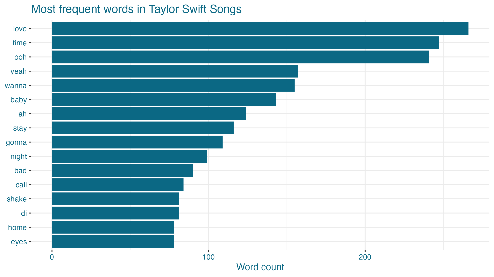
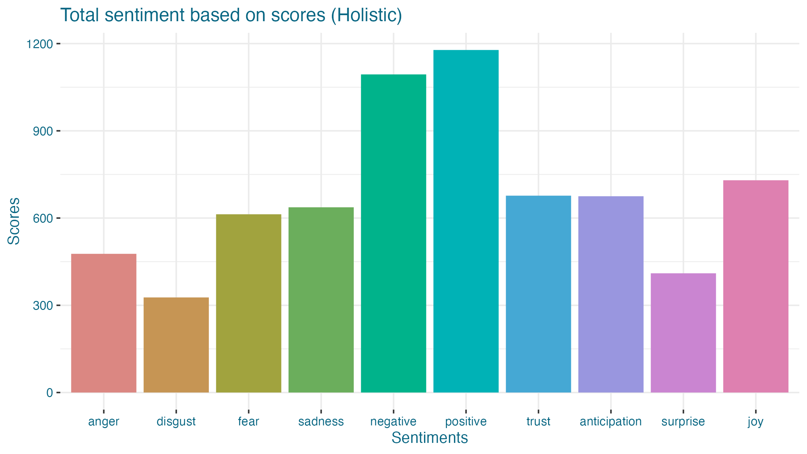
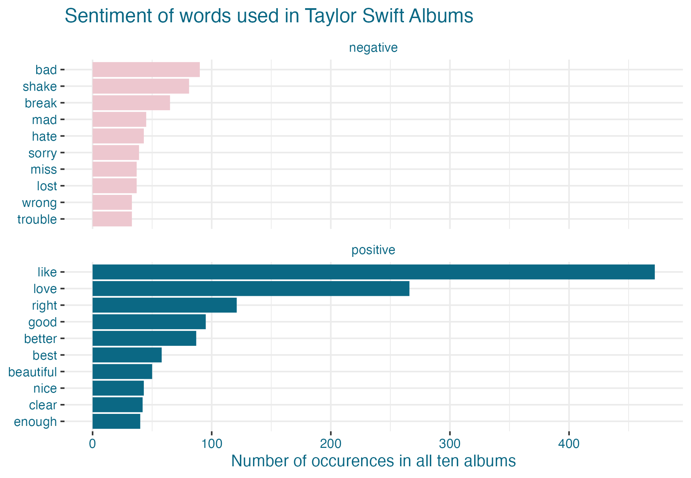
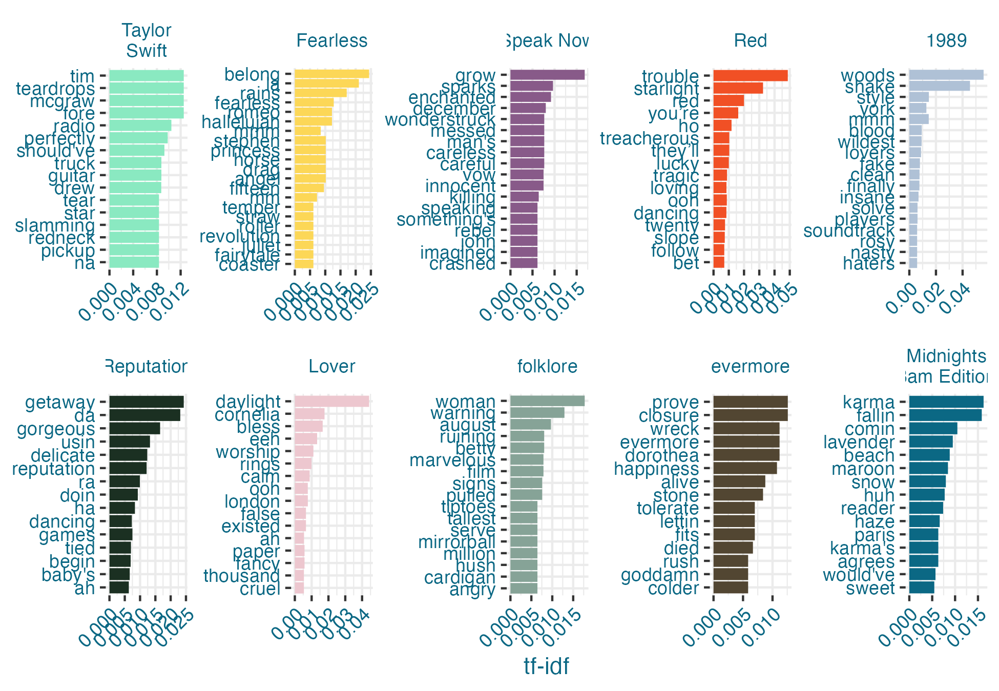
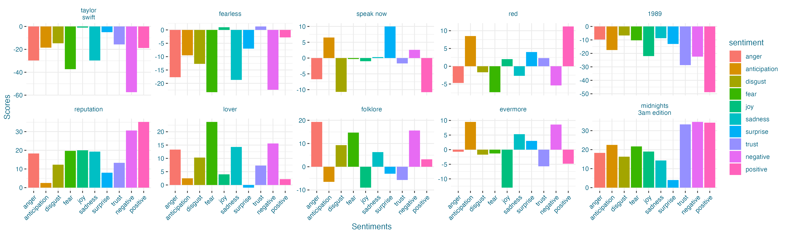
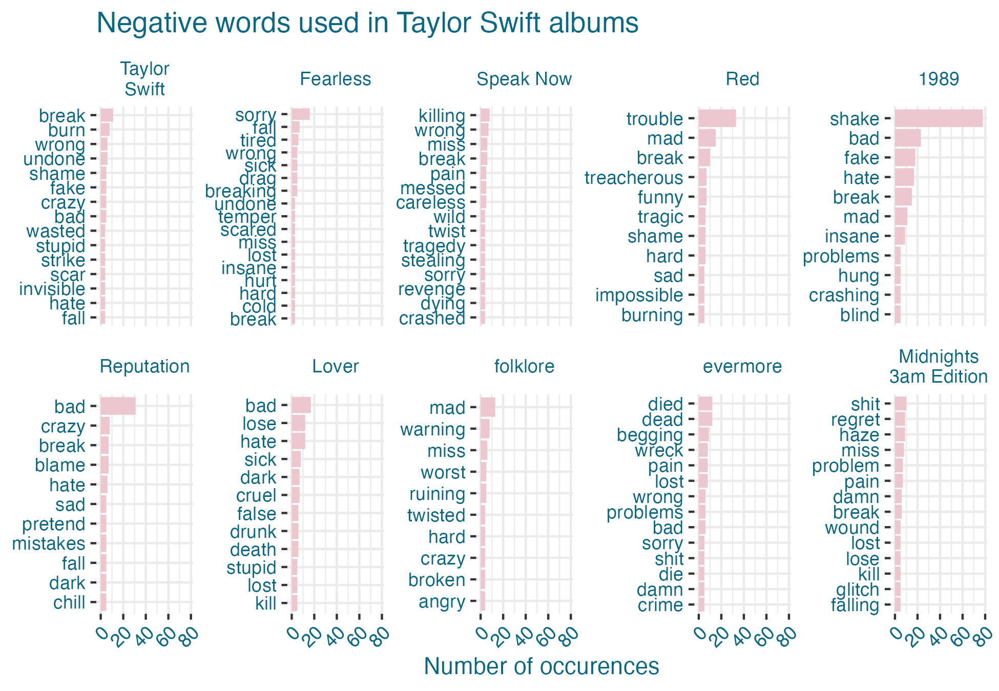
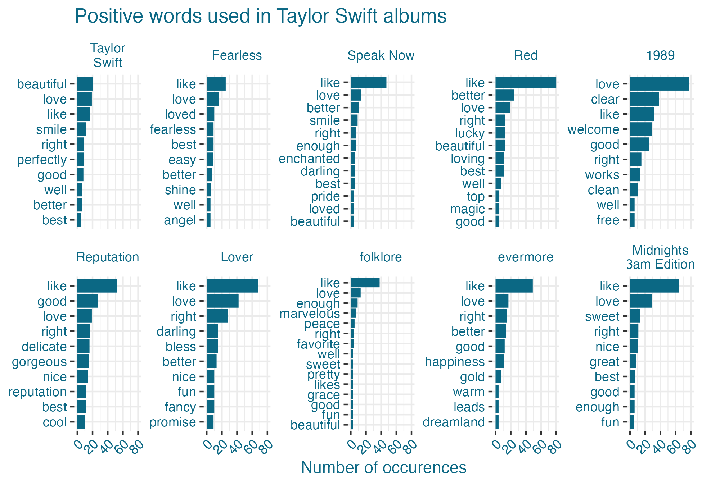
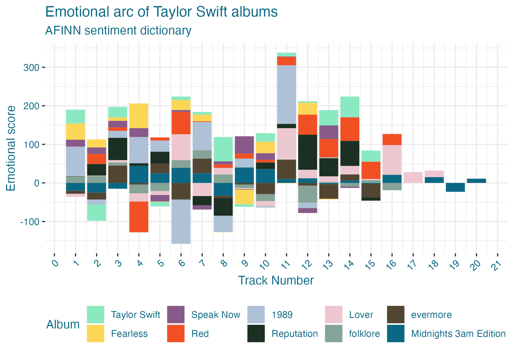

```{r setup, include=FALSE , warning=FALSE}
knitr::opts_chunk$set(echo = FALSE)

library(xaringanthemer)
palette <- taylorswiftthemes::taylor_palette("all_albums2")

style_mono_accent(
  base_color = palette[10],
  white_color = "#faf5f6",
  header_font_google = google_font("Josefin Sans"),
  text_font_google   = google_font("Ubuntu", "300", "500i", "500"),
  code_font_google   = google_font("Fira Mono"),
  header_h1_font_size = "2.2rem",
  text_font_size = "1.2rem"
)
```


# About me!

* Trained as political scientist
* Background in math / philosophy
* Love for **agent-based models** and **data visualization**

---
# Current work : Two main projects

* Housing (*new project!*)

--
* Taylor Swift


---

# Housing in MPLS: 2040 plan

* **Minneapolis' 2040 plan** effectively bans new single-family homes through zoning approaches
* Plan in limbo but question remains: is this an **effective way to address affordable and accessible housing**?

---
# Project: Carrots and Sticks (housing policy in minneapolis)

* **Agent-Based Model**: parameters of the city

--
* Aiming for a complex but not 100% realistic rendering

--
* Hoping to **calibrate with local data** but we'll see

---
# Phases

* Setup of model

--
* Predict response to announcement of policy (compare movement to explore if people /prices shift)

--
* Test **multiple housing policies** to explore
  * Ban (e.g. MPLS 2040)
  * Incentives for new (re) development
  * Penalties or costs for low density development 
  
--
* Explore **discourse around policy**
  * LA development
  * Office building redevelopment (NYC)

---
class: center

# Taylor Swift


```{r bejeweled, fig.align = 'center', out.width="100%"}

knitr::include_graphics("https://64.media.tumblr.com/b1b379fe983f77ad8ce62411ed0328db/cd645e56f1547b02-90/s640x960/82c3c608de0e02eb2f053b4a6f881ced331c08e0.gifv")

```

---
# Project overview

* **Lyrics** of all work (focusing on original studio recordings -- e.g. no Taylor's Version except for tour info)
* Data on **Eras Tour**

---

# Guiding questions:

* What can we learn about **Swift's work**?

--
* How has her work **changed over time**?

--
* How can we think about the Eras Tour w/r/t how an **artist imagines and packages their work**?

---
class: center, middle
# Preliminary findings

---
# Overall body of work

* Dominant words
* Sentiment
* Positive / negative words

---
# Frequent words

```{r words, out.width="85%"}




```

Above we see that her work is **overwhelmingly about love** (which tracks, given her reputation for writing about breakup songs). We also see some simple words that are recognizable given the structure of her songs. Let's dig deeper!
---
# Overall sentiment

```{r sentiment, fig.align = 'center', out.width="75%"}




```
More positive sentiment than negative, but general balance: loosely structured from most negative to most positive sentiments. 

---
# Positive / negative words

```{r pos-neg, out.width="80%"}




```

*future work: explore use of* **like** *in work*

---
class: center 
# By album 
**(temporal exploration)**

```{r eras-gif, fig.align = 'center', out.width="45%"}

knitr::include_graphics("https://64.media.tumblr.com/0101577cd3b0ae823f4100d4b66630bb/6cc4c8bb51e8a7c6-fa/s640x960/f2b5970caf31fc6e03a289420cc09a781968dca7.gifv")


```


---
# Frequent words

```{r words-album, fig.align = 'center', out.width="75%"}




```
We can see three things: a) **song-specific words** (repetive song structure), b) **language evolution** from more fanciful to more 'direct' language, and c) lots of **evocative nouns**, particularly in her more 'country' work and her more 'story' albums (evermore and folklore). 

---
# DIFFERENCE in average sentiment

```{r sentiment-album, fig.align = 'center', out.width="100%"}




```

These are very preliminary but suggest that her **later work is more emotionally charged** than her earlier work -- here, we're looking at differences from the average. 

---
# Positive / negative words

```{r neg-album, fig.align = 'center', out.width="75%"}




```
As in the case of the overall evolution, we see much **more mature language **here (wrong and stupid vs shit and regret).
---

# Positive / negative words
```{r pos-album, fig.align = 'center', out.width="75%"}



```
Two things: a) **consistency** (like and love) and b) **more imaginative vs direct** (perfect, beautiful vs pretty, great, best). 

---
# Track five

```{r sent-album, fig.align = 'center', out.width="75%"}



```

Look at bar height and distribution to explore whether some tracks tend to be more positive, negative, and/or more range. We don't see that Track 5 are the most personal (maybe Track 6?). **Track 11 seems to be the 'glitter pen' songs.** 

---
# Next steps

* Digging more into literature
* Incorporating Eras setlist (separate: what is / not included)
* Additional data (album measures (PCA), TikTok data)


```{r ts_gif, fig.align = 'center', out.width="80%"}
knitr::include_graphics("https://media.giphy.com/media/tNTq5fw9apN2OzZID9/giphy.gif")
```
